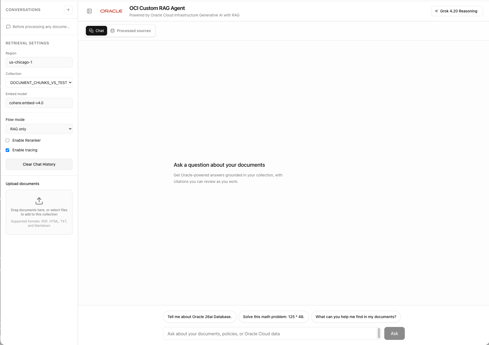
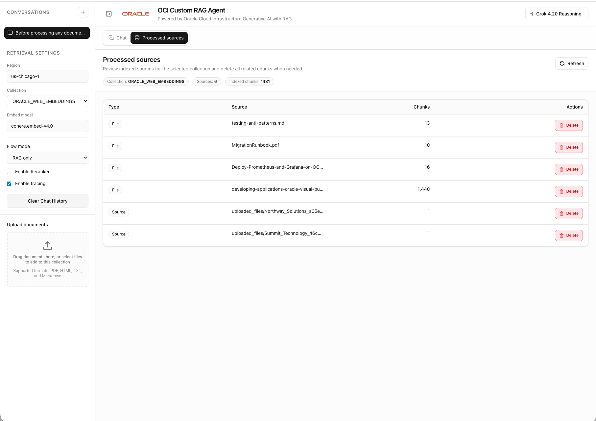
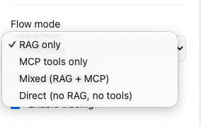
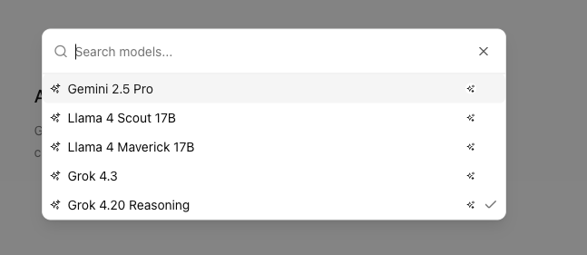
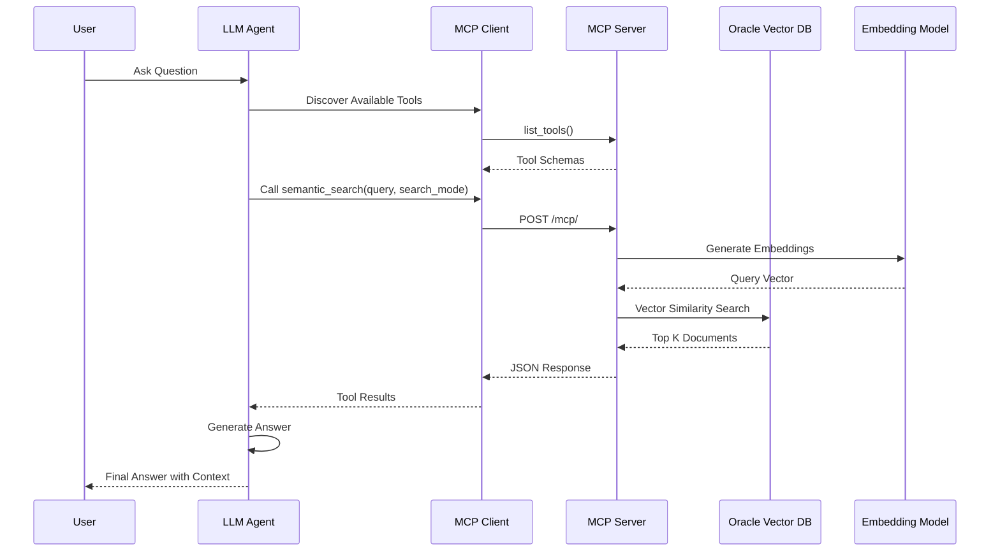

# Oracle 26ai LangChain RAG

[](LICENSE)

A LangChain-powered Oracle RAG application with chat, MCP tools, and observability.



## What this repo is

This repository is best understood as a **reference implementation**, not a zero-config starter. It combines:

- a FastAPI backend with LangGraph-compatible thread/run endpoints
- `ChatRuntimeService` mode dispatch for retrieval, MCP tools, direct chat, and follow-up transforms
- a Next.js chat frontend with streaming responses and citations
- Oracle/OCI-backed embeddings, chat models, and vector search
- optional observability with OpenTelemetry, Grafana/Tempo/Loki, and Langfuse

If you want the fastest path to a realistic first run, start with:

- [`docs/GETTING-STARTED.md`](docs/GETTING-STARTED.md)
- [`docs/CONFIGURATION.md`](docs/CONFIGURATION.md)
- [`docs/DOCKER-SETUP.md`](docs/DOCKER-SETUP.md)

## Overview

This application provides an intelligent question-answering system that:

- Retrieves relevant document chunks from Oracle vector search
- Reranks results before answer generation
- Supports follow-up interpretation and grounded reformatting
- Supports optional MCP tool usage in `mcp`, `mixed`, or `direct` flows
- Streams answers to the UI with citations and source references

## Screenshots

The UI includes the main chat workspace, document upload controls, source review, and runtime selectors.

### Chat workspace and document upload


### Processed sources



### Flow mode selector



### Model selector



## Architecture

The active backend runtime is centered on `ChatRuntimeService` in `src/rag_agent/runtime/chat_service.py`. API routes normalize incoming chat turns, dispatch to one of the explicit runtime modes, and return stable chat responses or LangGraph-compatible `event: values` streams.

## LangGraph Agent Server development

Run the graph server locally:

```bash
uv run langgraph dev
```

The graph id is `chat_agent`, and `langgraph.json` keeps FastAPI mounted through `api/main.py:app` for the current compatibility phase.

### Key Directories

| Directory                       | Purpose                                                                                        |
| ------------------------------- | ---------------------------------------------------------------------------------------------- |
| `src/rag_agent/runtime/`        | Chat runtime, streaming adapters, memory, retrieval helpers, and thread state persistence      |
| `src/rag_agent/workflows/`      | Repeated MCP workflow helpers and work-unit extraction                                         |
| `src/rag_agent/infrastructure/` | OCI, Oracle vector search, MCP adapter, and model/tool integrations                            |
| `api/`                          | FastAPI app, chat/config/documents/feedback/health routers, and LangGraph-compatible endpoints |
| `frontend/`                     | Next.js app; `src/app`, `src/components`, and `src/lib` chat/config/types                      |
| `mcp_servers/`                  | MCP servers for RAG, semantic search, and minimal local tools                                  |
| `scripts/`                      | Document population, database/table utilities, stack management, and API doc sync              |
| `tests/`                        | Unit, workflow, integration, and manual run scripts                                            |
| `docs/`                         | Setup, MCP usage, tracing, OCI, database, and generated API documentation                      |

## Data Flow

```
User Query
    ↓
[Normalize Messages] → stable ChatMessage payload
    ↓
[Mode Dispatch] → rag | mcp | mixed | direct
    ↓
[RAG Path] Oracle retrieval + answer prompt
        OR
[MCP Path] configured MCP tools
        OR
[Mixed Path] Oracle retrieval tool + MCP tools in one agent loop
        OR
[Direct Path] LLM on chat history only
    ↓
[References + State] → citations, context usage, MCP metadata, thread memory
    ↓
Next.js UI → streamed answer + citations
```

## Technology Stack

| Layer                  | Technology                                                                         |
| ---------------------- | ---------------------------------------------------------------------------------- |
| Backend API            | FastAPI, Pydantic, Uvicorn                                                         |
| Agent runtime          | LangChain v1 agents, LangGraph-compatible thread/run APIs, LangChain MCP adapters  |
| Retrieval              | Oracle 26AI / Oracle AI Vector Search through `langchain-oracledb`                 |
| LLM and embeddings     | OCI Generative AI through `langchain-oci`; optional OpenAI-compatible model wiring |
| Reranking              | Native OCI Gen AI rerank with lexical filtering on rerank failure                  |
| Frontend               | Next.js 16, React 19, TypeScript, Tailwind CSS v4, Radix UI, Streamdown            |
| Streaming protocol     | LangGraph-compatible SSE `event: values` streams consumed by `@langchain/react`    |
| Optional observability | OpenTelemetry OTLP, Grafana, Tempo, Loki, OCI APM, Langfuse                        |
| Tooling                | Python 3.11, `uv`, `pnpm`, Docker Compose, Playwright, Ruff, Black, Mypy, Pytest   |

## Setup

**New here?** Start with the step-by-step guide: [`docs/GETTING-STARTED.md`](docs/GETTING-STARTED.md).

### Prerequisites

1. **Oracle 26AI Database / Oracle AI Vector Search** with:
   - Vector search enabled
   - Wallet configured for secure connection
   - Permission to create or use the configured knowledge-base table, defaulting to `RAG_KNOWLEDGE_BASE`

2. **OCI Account** with:
   - Generative AI service access
   - API keys configured in `~/.oci/config`
   - Compartment permissions for chat, embeddings, and native rerank models

3. **Python 3.11**
4. **uv** for Python dependency management
5. **Node.js and pnpm** for the Next.js frontend
6. **Docker or Colima/Docker Desktop** if you plan to run the backend/frontend or optional observability stacks through Compose
7. **Optional observability configuration** only if you enable tracing or monitoring:
   - OCI APM or OTLP endpoint if sending traces outside the local stack
   - Langfuse keys if using Langfuse trace UI

### Installation

This project uses `uv` for package management with `pyproject.toml` as the source of truth.

```bash
# Install uv (if not already installed)
# macOS/Linux: curl -LsSf https://astral.sh/uv/install.sh | sh
# Or: pip install uv

# Sync project dependencies (creates .venv, installs all dependencies, generates uv.lock)
uv sync
```

**Note**: The project uses `uv` and `pyproject.toml` for dependency management. Use `uv run` to run commands so the project virtualenv is used automatically.

OCI and Oracle AI Vector Search integrations use the official [oracle/langchain-oracle](https://github.com/oracle/langchain-oracle) packages: **langchain-oci** (LLM and embeddings) and **langchain-oracledb** (vector store). See that repository for documentation and examples.

**OCI Gen AI** is used via **ChatOCIGenAI** (from langchain-oci) for RAG answer synthesis, follow-up interpretation, and MCP tool-calling. Native OCI Gen AI rerank is used for retrieval reranking. Auth uses the OCI profile from config (`~/.oci/config`).

**Development dependencies**:

```bash
# Install with development tools (pytest, black, ruff, mypy)
uv sync --group dev
```

**Live AI workflow e2e checks** are opt-in because they call the configured OCI LLM:

```bash
RUN_INTEGRATION_TESTS=1 OCI_INTEGRATION_TESTS=1 AI_WORKFLOW_E2E_TESTS=1 \
  uv run pytest tests/integration_tests/test_ai_repeated_workflow_e2e.py -q -s
```

### Configuration

**IMPORTANT**: Copy `.env.example` to `.env` and set your values. The `.env` file is in `.gitignore` and will not be committed.

1. **Create your env file**:

   ```bash
   cp .env.example .env
   ```

2. **Edit `.env`** – set at least:
   - **Database**: `VECTOR_DB_USER`, `VECTOR_DB_PWD`, `VECTOR_DSN`, `VECTOR_WALLET_DIR`, `VECTOR_WALLET_PWD`
   - **OCI**: `OCI_PROFILE`, `COMPARTMENT_ID`, `REGION`
   - **Models**: `LLM_MODEL_ID`, `EMBED_MODEL_ID` (defaults exist; override as needed)

   See `docs/CONFIGURATION.md` and `.env.example` for all options.

## Usage

### 1. Run the Application

#### Local ports

| Service            | URL                   | Notes                                    |
| ------------------ | --------------------- | ---------------------------------------- |
| Backend (FastAPI)  | http://localhost:3002 | Default API port                         |
| Frontend (Next.js) | http://localhost:4000 | Repo standard for dev and Docker         |
| Grafana            | http://localhost:3051 | Only when observability stack is enabled |
| Langfuse UI        | http://localhost:3300 | Only when Langfuse stack is enabled      |

#### Option A – Local processes

```bash
# Terminal 1 – FastAPI backend
./run_api.sh

# Terminal 2 – Next.js UI (port 4000)
cd frontend
pnpm install
cp env.example .env.local
PORT=4000 pnpm dev
```

#### Option B – Docker Compose (backend + frontend)

```bash
docker compose up -d backend frontend
# or just `docker compose up -d` to include any other services defined
```

- API: http://localhost:3002 (default; override with `PORT` env var)
- Frontend: http://localhost:4000 (container exposes port 3000 at 4000 per compose)
- Logs: `docker compose logs -f backend` (or `frontend`)
- Stop: `docker compose down`

#### Optional observability stack (Grafana/Loki/Tempo)

```bash
docker compose --profile observability up -d loki tempo otel-collector grafana
# stop:
docker compose --profile observability down
```

This starts the collector + Loki + Tempo + Grafana defined in `docker-compose.yml`.

If you are running the API locally (Option A), you can also have `./run_api.sh` start these containers by setting `ENABLE_OBSERVABILITY_STACK=true` in `.env`.

#### Optional Langfuse stack

If you want [Langfuse](https://github.com/langfuse/langfuse) SDK traces locally:

```bash
cp observability/langfuse/.env.example observability/langfuse/.env
# edit secrets
docker compose -f observability/langfuse/docker-compose.yml up -d
```

The Langfuse UI will run at `http://localhost:3300` (default) using its own compose file so it doesn’t interfere with the main stack. See `observability/langfuse/README.md` for details.

- API: http://localhost:3002 (default; override with `PORT` env var)
- Frontend: http://localhost:4000 (Next.js dev server reads API URL from env)

#### Optional one-command stack management

1. Stacks are defined in `api/settings.py` (DOCKER_STACKS). Override in `.env` if needed (JSON).
2. Use the helper script:

   ```bash
   # Bring up every stack with enabled=True
   uv run python scripts/manage_stacks.py up

   # Target specific stacks
   uv run python scripts/manage_stacks.py up --stacks core
   uv run python scripts/manage_stacks.py status --stacks langfuse
   uv run python scripts/manage_stacks.py down --stacks observability langfuse
   ```

3. The script uses `get_settings().DOCKER_STACKS` and shells out to `docker compose`.
   If no stacks are specified, it also auto-includes `observability` when
   `ENABLE_OBSERVABILITY_STACK=true` or `ENABLE_OTEL_TRACING=true`, and
   `langfuse` when `ENABLE_LANGFUSE_TRACING=true`.

### 2. Add documents

The primary path is the UI: use the sidebar **Upload documents** control to add PDF, HTML, TXT, Markdown, or MD files to the selected collection. The **Processed sources** tab shows indexed sources, chunk counts, refresh, and delete actions.

For batch imports or automation, use the CLI entrypoint. It wraps the same ingestion implementation used by the upload API.

```bash
# Process specific files
uv run python scripts/ingest_documents.py --files document1.pdf document2.pdf readme.md

# Process all supported files in a directory
uv run python scripts/ingest_documents.py --dir ./documents
```

### 3. Query the Knowledge Base

1. Enter your question in the chat interface
2. The agent processes through all workflow stages
3. View intermediate results in the sidebar:
   - Standalone question (when a follow-up is rewritten for retrieval)
   - References (after reranking)
4. Receive streaming answer with citations

## Features

### ✨ Streaming Responses

- Real-time answer generation
- Progressive UI updates as each stage completes
- Immediate display of document references

### 🔄 Chat History and Memory

- Maintains conversation context (`chat_history` in state)
- Rewrites retrieval-oriented follow-up questions when needed
- Configurable history length (`MAX_MSGS_IN_HISTORY`)
- When `ENABLE_PERSISTENT_MEMORY=true`, thread state is persisted per `thread_id`
  in the SQLite file configured by `LANGGRAPH_SQLITE_PATH`

### 🎯 Intelligent Reranking

- Native OCI Gen AI rerank relevance scoring
- Filters out irrelevant documents
- Improves answer accuracy

### 📊 Observability (Optional)

- OCI APM integration for tracing
- Performance monitoring
- Error tracking

### 🔒 Security

- Wallet-based database authentication
- OCI profile for GenAI; no secrets in repo (use `.env` from `.env.example`)

**OCI keys (Docker best practice: use [Secrets](https://docs.docker.com/compose/use-secrets/) for API keys, not env vars for key content):**

- **Without Docker:** Keys in local files. Use `local-config/oci/config` with `key_file=../oci_api_key.pem` (relative to config file) so the same config works locally and in Docker.
- **With Docker:** Compose uses a secret for the key (mounted at `/run/secrets/oci_api_key`); the app is given the path via `OCI_KEY_FILE`. Key content is never in the image or in environment variable values. Config and wallet remain in the `./local-config` volume.

## MCP (Model Context Protocol) Integration

The application includes **MCP server** support, allowing LLM agents to interact with the vector database through standardized tools. This enables external agents (like Claude Desktop, custom LLM applications) to perform semantic search and query your knowledge base.

### MCP User Flow



### MCP Tools

The MCP server exposes three main tools:

1. **`semantic_search`** - Search for relevant documents
   - Parameters: `query`, `top_k`, `collection_name` (optional), `search_mode` (optional: `vector`/`hybrid`/`text`)
   - Returns: Relevant document chunks with metadata

2. **`get_collections`** - List available collections
   - Returns: List of vector table names in the database

3. **`list_documents_in_collection`** - List documents in a collection
   - Parameters: `collection_name` (optional)
   - Returns: List of unique document sources with chunk counts

The **RAG MCP server** (`mcp_rag_server.py`) exposes **`rag_ask`** for full RAG (query → search → rerank → answer with citations).

### Using MCP

This repo supports MCP in two distinct ways:

1. **Expose standalone MCP servers** from `mcp_servers/` such as `mcp_semantic_search.py` and `mcp_rag_server.py`.
2. **Consume MCP servers inside the app** through the LangGraph-compatible chat routes with `mode="mcp"` or `mode="mixed"`.

See [`docs/MCP-USAGE.md`](docs/MCP-USAGE.md) for the detailed usage guide.

## Advantages of Agentic Approach

The modular LangGraph architecture provides:

1. **Flexibility**: Easy to add/remove/modify workflow steps
2. **Observability**: Each step can be monitored independently
3. **Error Handling**: Graceful degradation at each stage
4. **Extensibility**: Simple to add features like:
   - PII detection and anonymization
   - Multi-language support
   - Custom filtering logic
   - Additional validation steps

## Example Workflow Execution

```
User: "What is Oracle 23AI?"

1. [Search] → Found 6 relevant document chunks
2. [Rerank] → Ranked and filtered to top 3 chunks
3. [Answer] → Generated answer with citations:

   "Oracle 23AI is Oracle's next-generation database..."

   References:
   - Oracle Docs (page 5)
```

## Documentation

- [Getting started](docs/GETTING-STARTED.md) – First run walkthrough
- [Configuration](docs/CONFIGURATION.md) – Backend/frontend env variables and settings
- [Docker setup](docs/DOCKER-SETUP.md) – Run services with Docker/compose
- [Database setup](docs/DATABASE-SETUP.md) – Vector DB and wallet configuration
- [Document population](docs/DOCUMENT-POPULATION.md) – Ingesting documents into the knowledge base
- [MCP usage](docs/MCP-USAGE.md) – Using MCP tools and RAG MCP server
- [OCI session token](docs/OCI-SESSION-TOKEN.md) – OCI session token auth
- [Tracing](docs/TRACING.md) – Observability and tracing
- [Observability routing](docs/OBSERVABILITY_ROUTING.md) – Combining local Grafana/Tempo, OCI APM, and OCI Logging Analytics

### Documentation site (GitHub Pages)

The public docs site is built with ReallySimpleDocs/Astro from the Markdown files in `docs/`.

**View locally:**

```bash
cd docs-site
npm install
npm run dev
```

Local dev serves the docs at `http://127.0.0.1:4321/`. Production builds use the GitHub Pages project path.

**Build for GitHub Pages:**

```bash
cd docs-site
npm run build
```

The build syncs Markdown from `docs/` into the Astro content tree and writes the static site to `docs-site/dist/`. GitHub Pages deployment is handled by `.github/workflows/docs-pages.yml`.

## Troubleshooting

See the [Documentation](#documentation) section above. For database or OCI issues, start with [`docs/DATABASE-SETUP.md`](docs/DATABASE-SETUP.md) and [`docs/OCI-SESSION-TOKEN.md`](docs/OCI-SESSION-TOKEN.md).

## Contributing

See [AGENTS.md](AGENTS.md) for contribution workflow, testing gate, and code style.

## License

MIT License

## References

- [LangGraph Documentation](https://docs.langchain.com/oss/python/langgraph/overview)
- [Oracle LangChain integration (langchain-oci, langchain-oracledb)](https://github.com/oracle/langchain-oracle)
- [Oracle 23AI Vector Search](https://docs.oracle.com/en/database/oracle/oracle-database/26/vecse/)
- [OCI Generative AI](https://docs.oracle.com/en-us/iaas/Content/generative-ai/home.htm)
