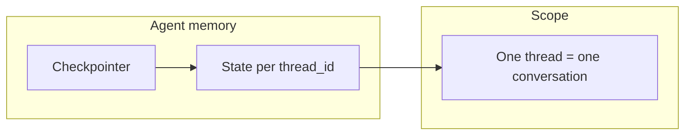
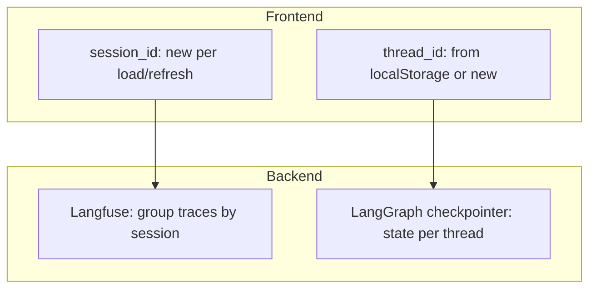
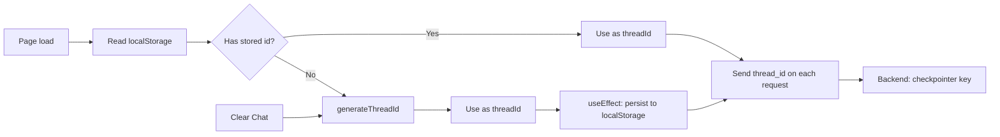

# Chat memory and sessions

This doc describes how conversation memory, **sessions**, and **threads** work in this app, and how they relate to LangGraph and observability.

## Overview

| Concept     | What it is                                                                       | Where it lives                                                                | Used for                                                           |
| ----------- | -------------------------------------------------------------------------------- | ----------------------------------------------------------------------------- | ------------------------------------------------------------------ |
| **Session** | One “browser visit”: new on each tab load or refresh, not persisted.             | Frontend only (in-memory); sent as `session_id` on each request.              | Langfuse: grouping traces into one “Session” per visit.            |
| **Thread**  | One **conversation**: stable across reloads, identified by a single `thread_id`. | Persisted in `localStorage` (key `rag_agent_thread_id`); sent as `thread_id`. | LangGraph checkpointer: short-term conversation memory per thread. |

So: **session** = “this tab/visit” (observability); **thread** = “this conversation” (agent memory).

---

## Agent memory: short-term only

We use **short-term memory** only (per [LangChain short-term memory](https://docs.langchain.com/oss/python/langchain/short-term-memory)):

- A **checkpointer** is passed when compiling the graph (`workflow.compile(checkpointer=...)`). Default: SQLite at `.local-data/langgraph-checkpoints.sqlite` (or `LANGGRAPH_SQLITE_PATH`).
- State (including `messages` with `add_messages` reducer) is persisted **per `thread_id`**. The persisted message history is bounded by `MAX_MSGS_IN_HISTORY`, so long-lived threads keep recent conversational context without unbounded checkpoint growth.
- We do **not** implement long-term memory (no cross-thread or cross-session user/agent memory, no summarization across conversations).

See [SERVER-OWNED-MEMORY.md](./SERVER-OWNED-MEMORY.md) for API contract, storage location, and config (`ENABLE_PERSISTENT_MEMORY`, `thread_id`, etc.).

---

## Session vs thread

**Session** and **thread** are independent:

- **Session**
  - **Definition**: One browser “visit” — new on each tab load or refresh; not persisted.
  - **Frontend**: `sessionId` from `useState(() => generateSessionId())` (UUID or `sess_<ts>_<rand>`). Not read from or written to `localStorage`.
  - **API**: Optional `session_id` in request body; description: “Browser/session ID for grouping traces (new per tab load or refresh)”.
  - **Backend**: Passed into run config as `metadata["langfuse_session_id"]` so Langfuse groups traces by session.

- **Thread**
  - **Definition**: One conversation — all messages in that conversation share the same `thread_id`. The checkpointer keys state by `thread_id`.
  - **Frontend**: `threadId` from `localStorage.getItem("rag_agent_thread_id")` on mount, or `generateThreadId()` if missing; persisted on change via `useEffect`.
  - **API**: Optional `thread_id` in request body; if omitted, server generates one.
  - **Backend**: `configurable["thread_id"]` is the checkpointer key for that conversation’s state.

See [TRACING.md](./TRACING.md) for session vs thread in the tracing context.

---

## Single-thread UX (browser storage)

The UI is **single-thread**: one active conversation at a time, keyed by browser storage.

1. **Initial thread id**  
   On mount, the app reads `localStorage.getItem("rag_agent_thread_id")`. If a non-empty value exists, it is used as `threadId`. Otherwise it generates a new id and (via `useEffect`) writes it to `localStorage`.

2. **Every request**  
   The request body includes `thread_id: threadId || undefined`, so the backend always receives the current thread id.

3. **New thread only via “Clear chat”**  
   The only place that changes `threadId` is “Clear Chat History”: it generates a new id, clears messages and refs, and calls `setThreadId(nextThreadId)`. The `useEffect` then persists the new id to `localStorage`.

There is no thread list and no “switch conversation” UI — one thread per browser (origin) until the user clears chat.

**Edge cases:**

- **localStorage disabled or full**: Initializer falls back to `generateThreadId()`; persistence may fail. Result: effectively a new thread each load.
- **Multiple tabs**: All tabs share the same `localStorage` key. They share the same thread id until one tab does “Clear chat”; other tabs only see the new id after they reload.

---

## Where it’s implemented

| Area                  | Files                                                                                                                                                |
| --------------------- | ---------------------------------------------------------------------------------------------------------------------------------------------------- |
| Session id (frontend) | `frontend/src/app/page.tsx`: `generateSessionId()`, `sessionId` state, sent as `session_id`                                                          |
| Thread id (frontend)  | `frontend/src/app/page.tsx`: `threadId` state, `THREAD_ID_STORAGE_KEY`, `handleClearChat`; `frontend/src/lib/chat/messages.ts`: `generateThreadId()` |
| API schema            | `api/schemas.py`: `thread_id`, `session_id` on chat request                                                                                          |
| Run config            | `api/dependencies.py`: `build_chat_config(thread_id=...)` → `configurable["thread_id"]`                                                              |
| Langfuse              | `api/routes/chat.py`, `src/rag_agent/utils/langfuse_tracing.py`: `session_id` → `metadata["langfuse_session_id"]`                                    |
| Checkpointer          | `src/rag_agent/langgraph/graph.py`: `get_default_checkpointer()`, `workflow.compile(checkpointer=...)`                                               |
| Thread delete         | `api/routes/chat.py`: `DELETE /api/threads/{thread_id}`; `api/services/graph_service.py`: `delete_thread(thread_id)`                                 |

---

## Related docs

- [SERVER-OWNED-MEMORY.md](./SERVER-OWNED-MEMORY.md) — Server-owned conversation memory, delta-only API, SQLite, config.
- [TRACING.md](./TRACING.md) — Langfuse setup, session vs thread for traces.
- [CHAT_STREAMING_PROTOCOL.md](./CHAT_STREAMING_PROTOCOL.md) — Streaming protocol, `thread_id` in responses.
- [MCP-USAGE.md](./MCP-USAGE.md) — Graph flow (Router, RAG vs MCP paths).
