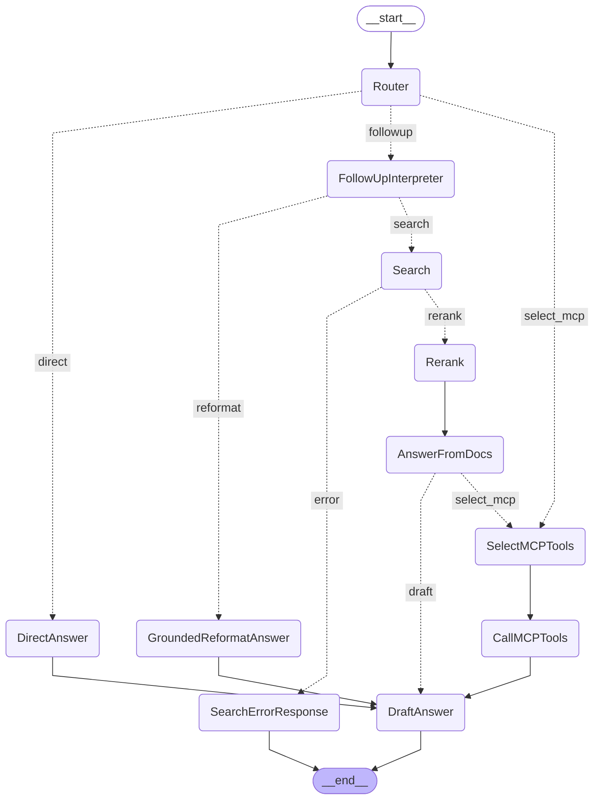

# MCP (Model Context Protocol) Usage

This project supports MCP in two ways:

| Role                       | Description                                                                                                                                                                                                                     |
| -------------------------- | ------------------------------------------------------------------------------------------------------------------------------------------------------------------------------------------------------------------------------- |
| **Exposing an MCP server** | This repo runs MCP servers (e.g. `mcp_servers/mcp_semantic_search.py`) that expose tools (semantic search, list collections). Other clients—Next.js UI or external apps—call these servers.                                     |
| **Consuming MCP**          | The FastAPI backend (called by the Next.js UI) acts as an **MCP client**: it connects to one or more MCP server URLs (from `config.MCP_SERVERS_CONFIG`), loads tools from those servers, and lets the LLM use them during chat. |

The sections below are split by **exposing** vs **consuming**.

---

## Part 1: Exposing an MCP server (this project)

You can run MCP servers from this repo so that the RAG app (or any MCP client) can call their tools.

### Available MCP servers

| File                                 | Transport  | Description                                               |
| ------------------------------------ | ---------- | --------------------------------------------------------- |
| `mcp_servers/mcp_semantic_search.py` | HTTP/Stdio | Semantic search + collections (set `TRANSPORT` in config) |
| `mcp_servers/mcp_rag_server.py`      | HTTP/Stdio | Full RAG pipeline as `rag_ask` tool                       |

### Tools exposed by the semantic search server

1. **`semantic_search`** – Search for relevant documents
   - Parameters: `query` (required), `top_k` (default: 5), `collection_name` (optional), `search_mode` (optional: `vector`/`hybrid`/`text`)
2. **`get_collections`** – List all available collections
3. **`list_documents_in_collection`** – List documents in a collection
   - Parameters: `collection_name` (optional)

### Quick start: run the MCP server, then the UI

1. **Start the MCP server** (exposing tools):

   ```bash
    uv run python mcp_servers/mcp_semantic_search.py
   ```

   Server listens on `http://localhost:9000` by default (or `PORT` from config). This is the standalone MCP server runtime. The backend's MCP client configuration is separate and comes from `MCP_SERVERS_CONFIG`, which may point to other preset MCP endpoints unless you override it.

2. **Start the FastAPI backend** (which consumes MCP servers on behalf of the UI) via `./run_api.sh`, then use the Next.js frontend to chat with MCP tools (see below).

### Testing the MCP server (call it directly)

**Python:**

```python
import asyncio
from fastmcp import Client

async def test():
    client = Client("http://localhost:9000/mcp")
    async with client:
        result = await client.call_tool(
            "semantic_search",
            {"query": "Oracle 23AI", "top_k": 5, "search_mode": "hybrid"}
        )
        print(result)

asyncio.run(test())
```

Or use the manual scripts (no pytest):  
`uv run python tests/run_mcp_semantic_search.py`,  
`uv run python tests/run_mcp_list_collection.py`,  
`uv run python tests/run_mcp_rag.py` (for the standalone RAG MCP server),

**cURL:**

```bash
curl -X POST http://localhost:9000/mcp \
  -H "Content-Type: application/json" \
  -d '{"jsonrpc":"2.0","id":1,"method":"tools/list"}' | python -m json.tool
```

---

## Part 2: Consuming MCP (RAG backend and UIs)

The RAG backend and UIs **consume** MCP: they connect to MCP server(s) and attach their tools to the LLM. Configuration is in `.env` (or environment) via `MCP_SERVERS_CONFIG` and related options; see `.env.example`.

### 1. Use one MCP in RAG chat (Next.js app)

- In `.env` (or environment), set `MCP_SERVERS_CONFIG` (JSON) with a `"default"` server URL. Example:

  ```python
  MCP_SERVERS_CONFIG = {
      "default": {
          "transport": "streamable-http",
          "url": "http://localhost:9000/mcp",   # MCP server URL to consume
      },
  }
  ```

- Set `ENABLE_MCP_TOOLS = True`.
- Restart the backend. The Next.js app does not send MCP settings; the backend uses this config.

### 2. Add another MCP as a preset (Next.js / API)

- In `MCP_SERVERS_CONFIG`, add another entry, e.g.:

  ```python
  MCP_SERVERS_CONFIG = {
      "default": { "transport": "streamable-http", "url": "http://localhost:9000/mcp" },
      "context7": { "transport": "streamable-http", "url": "http://localhost:9000/mcp" },
  }
  ```

- **Next.js UI**: In the sidebar, paste the preset URL you want (for a local server, typically `http://localhost:9000/mcp`) and click **Connect / Reload tools**.
- **Legacy API note**: `POST /api/mcp/chat` remains in the repo for compatibility, but in the current codebase it reports `MCP integration not available` because the old `AgentWithMCP` path is stubbed. Use `POST /api/chat` with `mode="mcp"` or `mode="mixed"` for supported MCP-enabled chat.

### 3. Use multiple MCPs in RAG chat at once

#### Tool selection (code-mode)

In mixed mode, the router uses code-mode tool discovery to decide whether the question matches any MCP tool. This keeps the RAG and MCP paths mutually exclusive (per question) and avoids calling irrelevant tools. The number of tools considered per question is capped by `MCP_TOOL_SELECTION_MAX_TOOLS`.

**Tool selection:** We use an LLM-based selector in `tool_selector.py` to pick a subset of MCP tools per question (Router for mixed-mode routing, and CallMCPTools when tools are not pre-registered). That fits our RAG + MCP flow. For very large tool sets, an embedding-based selector could be added later.

- Set which configured servers to load via `MCP_SERVER_KEYS` (optional; if unset, only `"default"` is used). This limits which MCP servers/tools are loaded; it does not by itself choose `mode`.

  ```python
  MCP_SERVER_KEYS = ["default", "context7"]
  ```

- Ensure each key exists in `MCP_SERVERS_CONFIG`. Restart the backend. The Answer node binds tools from all listed servers; duplicate tool names are prefixed (e.g. `context7_query-docs`, `default_semantic_search`).

### 4. Use an external MCP server (outside this project)

You can point this app at any HTTP MCP server (different repo or machine).

- **Next.js UI**: Use the sidebar MCP settings (no Streamlit app required) to point at the external server, then click **Connect / Reload tools**.
- **Preset in config**: Add an entry to `MCP_SERVERS_CONFIG` (e.g. `"external": { "transport": "streamable-http", "url": "http://YOUR_HOST:PORT/mcp/" }`) and use that URL in the UI or API.
- **Next.js**: The backend uses `MCP_SERVERS_CONFIG["default"]`; set it to your external URL and keep `ENABLE_MCP_TOOLS = True`. The frontend does not send MCP URL.
- **Cursor IDE**: To use an external MCP from Cursor, add it in Cursor Settings → MCP (HTTP URL or stdio command). That is independent of this app’s config.

---

## Configuration (.env / environment)

| Variable             | Used when     | Meaning                                                                                    |
| -------------------- | ------------- | ------------------------------------------------------------------------------------------ |
| `MCP_SERVERS_CONFIG` | **Consuming** | Dict of MCP server names → `{ "transport", "url" }`. Backend and UI connect to these URLs. |
| `MCP_SERVER_KEYS`    | **Consuming** | Optional list of keys from `MCP_SERVERS_CONFIG` to load (default: only `"default"`).       |
| `ENABLE_MCP_TOOLS`   | **Consuming** | If True, RAG chat attaches MCP tools from config; if False, MCP is disabled for chat.      |
| `MCP_SEARCH_MODE`    | **Consuming** | Default semantic-search mode for MCP servers in this repo: `vector`, `hybrid`, or `text`.  |
| `PORT`               | **Exposing**  | Port for this project’s MCP server (e.g. `mcp_semantic_search.py`).                        |
| `HOST`               | **Exposing**  | Listen address for this project’s MCP server.                                              |
| `TRANSPORT`          | **Exposing**  | `"streamable-http"` or `"stdio"` for the server.                                           |

---

## RAG vs MCP flow (mode)

The graph has three entry routes after `Router`:

- **`followup`** → `FollowUpInterpreter`, which then routes to either `Search` (`search`) or `GroundedReformatAnswer` (`reformat`)
- **`select_mcp`** → `SelectMCPTools` → `CallMCPTools`
- **`direct`** → `DirectAnswer`

In `mixed` mode, the workflow can start with retrieval and still fall back to MCP after `AnswerFromDocs` when `mcp_tool_match` is present and the RAG answer is weak or missing citations.

| mode     | Behavior                                                                                                                                                                                                       |
| -------- | -------------------------------------------------------------------------------------------------------------------------------------------------------------------------------------------------------------- |
| `rag`    | Retrieval path: `Router` → `FollowUpInterpreter` → `Search` → `Rerank` → `AnswerFromDocs` → `DraftAnswer`. If the follow-up intent is `reformat`, the graph uses `GroundedReformatAnswer` instead of `Search`. |
| `mcp`    | MCP-only path: `Router` → `SelectMCPTools` → `CallMCPTools` → `DraftAnswer`.                                                                                                                                   |
| `mixed`  | Starts with the retrieval path or MCP path based on routing. After `AnswerFromDocs`, the graph can still route to `SelectMCPTools` when `mcp_tool_match` is set and the RAG answer is weak or lacks citations. |
| `direct` | No retrieval or tools: `Router` → `DirectAnswer` → `DraftAnswer`.                                                                                                                                              |

- **API**: Send `mode` and optional `mcp_server_keys`. If you send `mcp_server_keys` and omit `mode`, the backend defaults to `mode=mixed`.
- **Reranker**: Still optional via `enable_reranker` (config or request). When enabled, `Rerank` runs after `Search`; when disabled, `retriever_docs` are passed through as `reranker_docs`.
- **Loop cap**: `max_rounds` (configurable, default 2) caps the MCP path for future “More info?” loops.

### Testing mixed mode

**From the UI:** In the sidebar, set **Flow mode** to **Mixed (RAG + MCP)**. Send a question; the backend routes **either** to RAG **or** MCP tools per question (never both in the same turn).

**With curl:** `curl -s -X POST http://localhost:3002/api/chat -H "Content-Type: application/json" -d '{"messages": [{"role": "user", "content": "What is OCI CLI? Then compute 2+2."}], "mode": "mixed", "stream": false}'`

Use `"mode": "mcp"` for tools only, `"mode": "rag"` for RAG only, `"mode": "direct"` for no RAG and no tools. Optionally send `"mcp_server_keys": ["default", "calculator"]` (keys must exist in `MCP_SERVERS_CONFIG`).

---

## Implementation (consuming side)

The flow uses the **code-mode MCP client/runtime** for tools. **CallMCPTools** (MCP path only) runs tools in a single-tool-per-turn loop in `get_mcp_answer`, where the LLM calls the `call_tool_chain` tool and code-mode executes the underlying MCP tools. **Router** routes into `FollowUpInterpreter`, `SelectMCPTools`, or `DirectAnswer`. `FollowUpInterpreter` then decides whether the next step is `Search` or `GroundedReformatAnswer`. After retrieval, `AnswerFromDocs` can still route to `SelectMCPTools` in `mixed` mode when `mcp_tool_match` is set and the RAG answer is weak or lacks citations. See `.env.example` and `docs/ORACLE-LANGCHAIN-STACK.md`.

### Flow diagram



| Path                     | When                                                                            | Outcome                                                                                   |
| ------------------------ | ------------------------------------------------------------------------------- | ----------------------------------------------------------------------------------------- |
| **Follow-up → search**   | Router resolves to `followup` and the follow-up intent is retrieval             | `Router` → `FollowUpInterpreter` → `Search` → `Rerank` → `AnswerFromDocs` → `DraftAnswer` |
| **Follow-up → reformat** | Router resolves to `followup` and the follow-up intent is `reformat`            | `Router` → `FollowUpInterpreter` → `GroundedReformatAnswer` → `DraftAnswer`               |
| **MCP path**             | Router resolves to `select_mcp`, or `AnswerFromDocs` falls back in `mixed` mode | `SelectMCPTools` → `CallMCPTools` → `DraftAnswer`                                         |
| **Direct**               | `mode=direct`                                                                   | `Router` → `DirectAnswer` → `DraftAnswer`                                                 |
| **Search error**         | `Search` sets `state["error"]`                                                  | `Search` → `SearchErrorResponse` → `END`                                                  |

---

## Common issues

- **404 in browser**: MCP servers are APIs, not web pages. Use the UI or test scripts.
- **Connection refused**: Ensure the MCP server you are **consuming** is running and the URL in `MCP_SERVERS_CONFIG` (or the UI) is correct. If you are **exposing**, check `PORT` and `HOST` in config.
- **Tools not appearing**: Restart the backend after changing `.env`, and confirm `ENABLE_MCP_TOOLS=true`.
- **Wrong URL path**: MCP HTTP servers use the `/mcp` path (example: `http://localhost:9000/mcp`).
- **Import errors**: Activate the virtual environment and install dependencies (e.g. `uv sync`).
- **Database errors**: Check database connection settings in `.env` (used by the semantic search MCP server).

---

## Resources

- [FastMCP Documentation](https://gofastmcp.com/getting-started/welcome)
- [MCP Protocol Specification](https://modelcontextprotocol.io/)
# Code mode runtime gate

Code mode is now gated behind `CODE_MODE_ENABLED` and is **disabled by default**. The active `/api/chat`
MCP path uses direct MCP tool binding; code mode remains optional infrastructure for separate runtime/server
paths and legacy tests.
