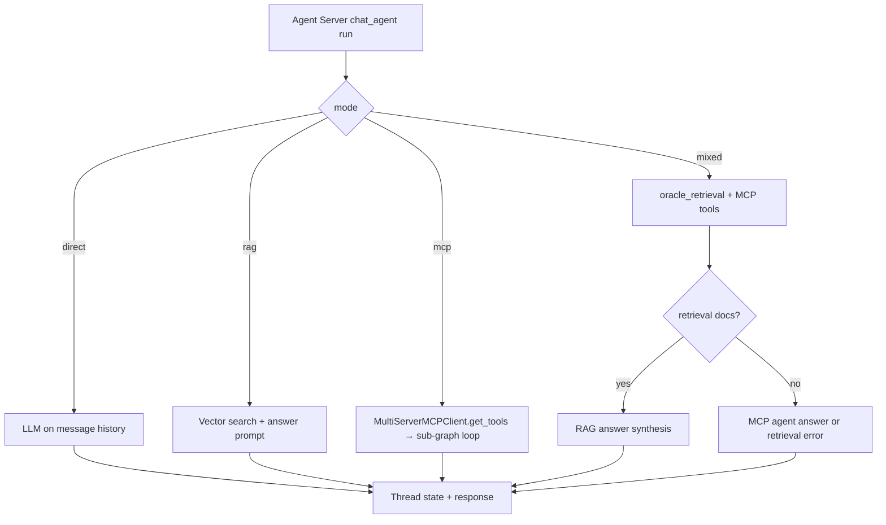

# MCP (Model Context Protocol) Usage

This project supports MCP in two ways:

| Role                       | Description                                                                                                                                                                                                                     |
| -------------------------- | ------------------------------------------------------------------------------------------------------------------------------------------------------------------------------------------------------------------------------- |
| **Exposing an MCP server** | This repo exposes the standalone Oracle Knowledge MCP with three typed evidence tools. Other clients call this server. |
| **Consuming MCP**          | The LangGraph `chat_agent` graph acts as an **MCP client**: it connects to one or more configured MCP server URLs, loads tools from those servers, and lets the LLM use them during chat. |

The sections below are split by **exposing** vs **consuming**.

---

## Part 1: Exposing an MCP server (this project)

For Oracle-backed evidence retrieval, see [ORACLE-KNOWLEDGE-MCP.md](ORACLE-KNOWLEDGE-MCP.md).
That server exposes exactly three typed tools and accepts friendly knowledge-base
keys only; answer synthesis and citation presentation remain with the caller.

Run the Oracle Knowledge MCP from this repo so the RAG app or any MCP client can call typed evidence tools.

### Oracle Knowledge MCP

`mcp_servers/oracle_knowledge.py` exposes exactly `search_knowledge`,
`list_knowledge_bases`, and `list_documents`. It accepts friendly keys only,
supports STDIO and Streamable HTTP, and leaves final answers/citations to the
caller. See [ORACLE-KNOWLEDGE-MCP.md](ORACLE-KNOWLEDGE-MCP.md).

### Quick start: run the MCP server, then the UI

1. **Start the Streamable HTTP profile**:

   ```bash
   ORACLE_KNOWLEDGE_TRANSPORT=streamable-http \
     ORACLE_KNOWLEDGE_HOST=127.0.0.1 \
     uv run python mcp_servers/oracle_knowledge.py
   ```

   Configure the remaining namespaced `ORACLE_KNOWLEDGE_*` settings first. The backend's MCP client configuration remains separate and is normally managed from the frontend Settings page. For STDIO, leave `ORACLE_KNOWLEDGE_TRANSPORT=stdio` and configure the client to launch the same Python command.

2. **Start the LangGraph Agent Server and frontend** with `make core-up`, then use the Next.js frontend to chat with MCP tools (see below).

### Testing the MCP server (call it directly)

**Python:**

```python
import asyncio
from fastmcp import Client

async def test():
    client = Client("http://localhost:9000/mcp")
    async with client:
        result = await client.call_tool("search_knowledge", {"query": "Oracle 23AI"})
        print(result)

asyncio.run(test())
```

Use an MCP client for protocol smoke tests; Streamable HTTP requires MCP
initialization and session headers, so a standalone JSON-RPC cURL request is
insufficient.

---

## Part 2: Consuming MCP (RAG backend and UIs)

The RAG backend and UIs **consume** MCP: they connect to MCP server(s) and attach their tools to the LLM. The Next.js Settings page is the primary configuration surface. It writes a server-side config file at `MCP_UI_CONFIG_FILE` so MCPs can be added, edited, disabled, tested, or deleted without editing `.env`.

### 1. Use one MCP in RAG chat (Next.js app)

- Set `ENABLE_MCP_TOOLS = True`.
- Open **Settings** from the chat header.
- Add a server with a stable key such as `default`.
- Set the transport and URL, for example `http://localhost:9000/mcp`.
- Use **Test connection** before saving when possible.

### 2. Optional seed config for headless or first-run setups

`MCP_SERVERS_CONFIG` is still supported as an optional seed or headless deployment config. If the UI config file does not exist yet, servers from this JSON object appear in Settings. After the first UI edit, the backend reads the UI-managed server list from `MCP_UI_CONFIG_FILE`.

```env
MCP_SERVERS_CONFIG={"default":{"transport":"streamable-http","url":"http://localhost:9000/mcp"}}
```

- **API note**: MCP-enabled chat is supported through the Agent Server `chat_agent` graph with `mode="mcp"` or `mode="mixed"` in top-level run `context`.

### 3. Use multiple MCPs in RAG chat at once

#### Which servers and tools load

- **Servers**: `MCP_SERVER_KEYS` (optional) limits which configured server keys are connected when loading tools. The request may also pass `mcp_server_keys` (same idea). This does not choose `mode`; it only filters which MCP endpoints are used.
- **Tools**: Tools come from `langchain_mcp_adapters.MultiServerMCPClient.get_tools()` (see `src/rag_agent/infrastructure/mcp_adapter_runtime.py`). Server names are prefixed on tool names when `tool_name_prefix=True` (for example, `default.search_knowledge`).

- Set which configured servers to load via `MCP_SERVER_KEYS` (optional; if unset, defaults follow `mcp_adapter_runtime._select_server_keys`, typically `"default"` when present).

  ```python
  MCP_SERVER_KEYS = ["default", "context7"]
  ```

- Ensure each key exists in Settings or in optional seed config. Restart the backend only after changing `.env`.

### 4. Use an external MCP server (outside this project)

You can point this app at any HTTP MCP server (different repo or machine).

- **Next.js UI**: Open **Settings**, add an MCP server with a stable key such as `external`, set the URL, and keep it enabled.
- **Preset in config**: Add an entry to `MCP_SERVERS_CONFIG` only if you want it to appear before any UI-managed override exists or you run without the frontend.
- **Next.js**: Keep `ENABLE_MCP_TOOLS = True`. The frontend manages MCP entries through backend config endpoints; chat requests still choose `mode="mcp"` or `mode="mixed"`.
- **Cursor IDE**: To use an external MCP from Cursor, add it in Cursor Settings → MCP (HTTP URL or stdio command). That is independent of this app’s config.

### OAuth-protected MCP servers

If your MCP server uses OAuth client credentials, configure it in **Settings** by selecting the server's **Auth mechanism** and entering the token URL, client ID, client secret, scope, audience, and grant type as needed. The client secret is stored server-side and is not returned to the browser after save.

You can also seed the same auth configuration from `.env` for headless or first-run setups:

```env
ENABLE_MCP_TOOLS=true
MCP_SERVERS_CONFIG={"default":{"transport":"streamable-http","url":"https://your-mcp-host/mcp","auth":{"type":"oauth_client_credentials","token_url":"https://auth.example.com/oauth/token","client_id":"your-client-id","client_secret":"your-client-secret","scope":"read:mcp"}}}
```

The backend fetches and refreshes the bearer token automatically and injects it into MCP requests.

---

## Configuration (.env / environment)

| Variable | Used when | Meaning |
| --- | --- | --- |
| `MCP_SERVERS_CONFIG` | **Consuming** | Optional seed/headless dict of MCP server names to `{ "transport", "url", "auth" }`. Settings is the primary UI-managed source. |
| `MCP_SERVER_KEYS` | **Consuming** | Optional list of configured server keys to load. |
| `ENABLE_MCP_TOOLS` | **Consuming** | Enables MCP tools in RAG chat. |
| `ORACLE_KNOWLEDGE_BASES` | **Exposing** | JSON mapping of public friendly keys to Oracle collections. |
| `ORACLE_KNOWLEDGE_DEFAULT_KEY` | **Exposing** | Friendly key used when a tool call omits one. |
| `ORACLE_KNOWLEDGE_ALLOWED_KEYS` | **Exposing** | Optional allowlist of public keys. |
| `ORACLE_KNOWLEDGE_CANDIDATE_LIMIT` | **Exposing** | Default retrieval candidate count. |
| `ORACLE_KNOWLEDGE_MAX_QUERY_LENGTH` | **Exposing** | Maximum query length. |
| `ORACLE_KNOWLEDGE_MAX_RESULT_LIMIT` | **Exposing** | Maximum returned evidence items. |
| `ORACLE_KNOWLEDGE_MAX_CANDIDATE_LIMIT` | **Exposing** | Maximum caller-selected candidate count. |
| `ORACLE_KNOWLEDGE_MAX_METADATA_FILTERS` | **Exposing** | Maximum metadata filters. |
| `ORACLE_KNOWLEDGE_TIMEOUT_SECONDS` | **Exposing** | Tool execution timeout. |
| `ORACLE_KNOWLEDGE_ENABLE_RERANKER` | **Exposing** | Enables OCI reranking. |
| `ORACLE_KNOWLEDGE_ALLOW_RERANKER_OVERRIDE` | **Exposing** | Allows per-request reranking overrides. |
| `ORACLE_KNOWLEDGE_ENABLE_OTEL_TRACING` | **Exposing** | Enables standalone-server tracing. |
| `ORACLE_KNOWLEDGE_TRANSPORT` | **Exposing** | `stdio` or `streamable-http`. |
| `ORACLE_KNOWLEDGE_HOST` | **Exposing** | Streamable HTTP bind address. |
| `ORACLE_KNOWLEDGE_PORT` | **Exposing** | Streamable HTTP port. |

The exposed Oracle server also reads OCI embedding settings and `VECTOR_*`
database connection settings from the root `.env`. See
[ORACLE-KNOWLEDGE-MCP.md](ORACLE-KNOWLEDGE-MCP.md). Generic `TRANSPORT`, `HOST`,
and `PORT` variables do not configure this server.

---

## RAG vs MCP flow (mode)

Chat is handled by the LangGraph Agent Server `chat_agent` graph. Request **`mode`** selects the path:

| API `mode` | Behavior                                                                                                                                                  |
| ---------- | --------------------------------------------------------------------------------------------------------------------------------------------------------- |
| `direct`   | LLM on chat history only; no vector search, no MCP tools.                                                                                                 |
| `rag`      | Vector similarity search + single answer prompt; MCP tools are not loaded.                                                                                |
| `mcp`      | MCP tools only (sub-graph loop); tools from `langchain_mcp_adapters`.                                                                             |
| `mixed`    | MCP tools plus the local **`oracle_retrieval`** tool in one LangChain agent loop. When retrieval returns documents, the final answer is synthesized through the RAG answer path. Non-retrieval MCP tool outputs from the same turn are passed into that synthesis as supplemental context. If retrieval is not used or returns no documents, the response comes from the MCP agent answer or a retrieval error. |

- **Default `mode`** (when not sent): `build_chat_config` in `api/dependencies.py` sets `mixed` when `ENABLE_MCP_TOOLS` is true and at least one MCP server is configured; otherwise `rag`.
- **API**: Send `mode` and optional `mcp_server_keys` in top-level run `context` to limit which MCP servers load.
- **RAG path**: Uses Oracle vector similarity search plus the graph-owned RAG answer path.
- **Mixed RAG handoff**: Mixed mode exposes `oracle_retrieval` and configured MCP tools together. When `oracle_retrieval` returns docs, the final answer is synthesized by the RAG runtime so answer text can stream after tool execution. Non-retrieval MCP tool results from the same turn are included as supplemental context. Retrieval infrastructure errors are surfaced as retrieval failures, not as "no documents found."
- **MCP tool-call limit**: `MCP_MAX_ROUNDS` (default 4) caps total tool calls in one agent run. Mixed mode may need more than two calls when a turn combines Oracle retrieval with MCP tool actions.

### Testing mixed mode

**From the UI:** In the sidebar, set **Flow mode** to **Mixed (RAG + MCP)**. Send a question; the backend loads `oracle_retrieval` and configured MCP tools. If the turn uses retrieval and finds docs, the answer streams from the RAG answer path with any non-retrieval MCP tool outputs included as supplemental context. If the turn uses only MCP tools, the MCP agent answer is returned.

**With curl:** `curl -X POST http://localhost:2024/threads/demo-thread/runs/stream -H "Content-Type: application/json" -d '{"assistant_id":"chat_agent","input":{"messages":[{"role":"user","content":"What is OCI CLI? Then compute 2+2."}]},"context":{"mode":"mixed"},"stream_mode":["values","messages","tools"]}'`

Use `"mode": "mcp"` for MCP tools only, `"mode": "rag"` for retrieval-only, `"mode": "direct"` for no retrieval and no MCP tools. Optionally send `"mcp_server_keys": ["default", "calculator"]` for configured server keys.

---

## Implementation (consuming side)

MCP and mixed chat modes load tools through **`langchain_mcp_adapters.MultiServerMCPClient`** (`src/rag_agent/infrastructure/mcp_adapter_runtime.py`; clients and tool lists are cached per connection set). The MCP tool loop runs through the **sub-graph architecture** — `run_mcp_setup` loads tools via `load_adapter_tools`, then the sub-graph runs the tool loop, and `run_mcp_compose` (both in `src/rag_agent/graphs/nodes/mcp.py`) extracts the final answer. In mixed mode, retrieved docs plus non-retrieval tool outputs are handed to the RAG runtime for answer synthesis when `oracle_retrieval` returns documents. RAG-only and direct modes do not load MCP tools.

### Flow diagram (high level)


```mermaid
flowchart TD
    A[Agent Server chat_agent run] --> C{mode}
    C -->|direct| D[LLM on message history]
    C -->|rag| E[Vector search + answer prompt]
    C -->|mcp| F[MultiServerMCPClient.get_tools → sub-graph loop]
    C -->|mixed| G[oracle_retrieval + MCP tools]
    G --> I{retrieval docs?}
    I -->|yes| J[RAG answer synthesis]
    I -->|no| K[MCP agent answer or retrieval error]
    D --> H[Thread state + response]
    E --> H
    F --> H
    J --> H
    K --> H
```

| Path         | When         | Main modules                                                 |
| ------------ | ------------ | ------------------------------------------------------------ |
| **`rag`**    | `mode=rag`   | Oracle VS + graph-owned RAG answer synthesis |
| **`mcp`**    | `mode=mcp`   | `mcp_adapter_runtime` → sub-graph nodes (`mcp.py` setup/compose) |
| **`mixed`**  | `mode=mixed` | `oracle_retrieval` tool + MCP tools → RAG answer synthesis when docs are found; otherwise MCP agent answer or retrieval error |
| **`direct`** | `mode=direct`| `get_llm().invoke` on history                               |

---

## Common issues

- **404 in browser**: MCP servers are APIs, not web pages. Use the UI or test scripts.
- **Connection refused**: Ensure the MCP server you are consuming is running and the URL in Settings or optional seed config is correct. For the Oracle Knowledge HTTP profile, check the namespaced host/port settings and `/mcp` endpoint.
- **Tools not appearing**: Confirm `ENABLE_MCP_TOOLS=true`, add or enable the server in Settings, and use **Test connection**. Restart the backend only after changing `.env`.
- **Wrong URL path**: MCP HTTP servers use the `/mcp` path (example: `http://localhost:9000/mcp`).
- **Import errors**: Activate the virtual environment and install dependencies (e.g. `uv sync`).
- **Database errors**: Check the Oracle connection, wallet, friendly-key mapping, and OCI embedding settings in `.env`.

---

## Resources

- [FastMCP Documentation](https://gofastmcp.com/getting-started/welcome)
- [MCP Protocol Specification](https://modelcontextprotocol.io/)
