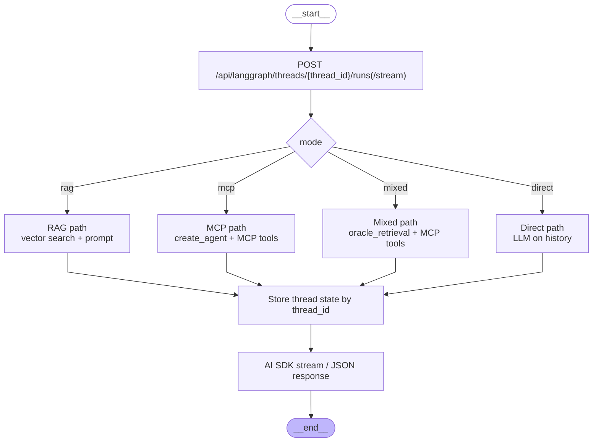
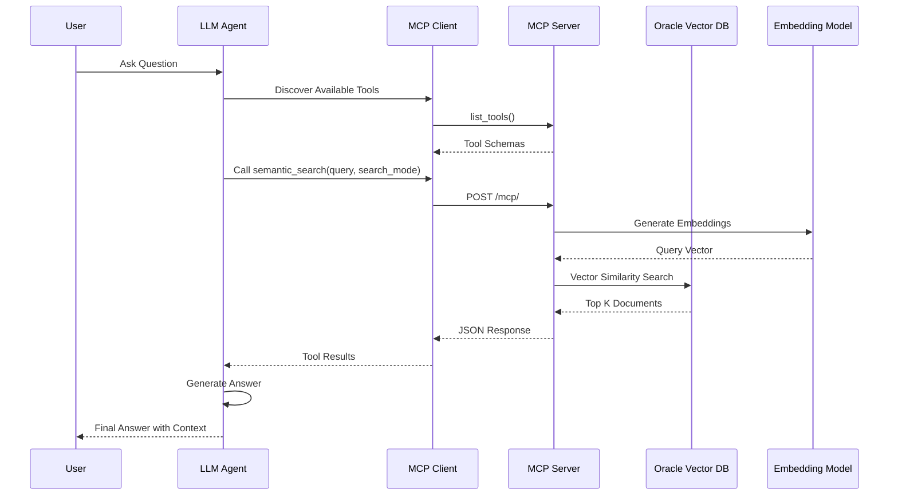

# Custom RAG Agent

A production-ready **Retrieval-Augmented Generation (RAG)** agent built with **LangChain**, **Oracle 26AI Vector Store**, and **OCI Generative AI**. It supports RAG, MCP, mixed, and direct chat modes with streaming responses.

## Overview

This application provides an intelligent question-answering system that:

- Processes user queries through runtime mode dispatch (`rag`, `mcp`, `mixed`, `direct`)
- Searches documents using semantic vector search
- Generates contextual answers with citations
- Supports streaming responses and real-time UI updates

## Architecture

Chat execution is handled by `ChatRuntimeService` (`api/services/graph_service.py`) with explicit mode dispatch:

- `rag`: Oracle vector similarity search + answer prompt
- `mcp`: MCP tools only through `langchain_mcp_adapters` + LangChain agent loop
- `mixed`: local retrieval tool (`oracle_retrieval`) + MCP tools together in one tool loop
- `direct`: plain LLM response from chat history

### Key Directories

| Directory        | Purpose                                                                                       |
| ---------------- | --------------------------------------------------------------------------------------------- |
| `src/rag_agent/` | Runtime and infrastructure modules (OCI models, MCP adapter/executor, prompts, tracing utilities) |
| `api/`           | FastAPI app, chat/config/documents/feedback/health routers, runtime invocation                 |
| `frontend/`      | Next.js app; `src/app` (pages/layout), `src/components`, `src/lib` (chat, config, types) |
| `mcp_servers/`   | MCP servers (RAG, semantic search, minimal)                                                   |
| `scripts/`       | Document population, table create/drop/truncate, BM25                                         |
| `tests/`         | Pytest and manual run scripts for MCP/workflow                                                |
| `docs/`          | Setup, MCP usage, tracing, OCI, database                                                      |



## Key Components

### 1. **Semantic Search**

- Performed via `langchain-oracledb` vector store in `ChatRuntimeService`
- Supports `vector`, `hybrid`, or `text` modes through settings
- Returns relevant chunks and normalized citations

### 2. **MCP Adapter Runtime**

- `MultiServerMCPClient` wiring in `src/rag_agent/infrastructure/mcp_adapter_runtime.py`
- Caches clients/tools per connection set
- Supports per-request server selection via `mcp_server_keys`

### 3. **MCP Agent Executor**

- `create_agent(...)` loop in `src/rag_agent/infrastructure/mcp_agent_executor.py`
- Built-in middleware for retries/tool-call bounds
- Shared prompts for MCP-only and mixed mode

### 4. **Citation Normalization**

- Centralized in `src/rag_agent/core/citations.py`
- Used across runtime and API response shaping

## Data Flow

```
User Query
    ↓
[Mode Dispatch] → rag | mcp | mixed | direct
    ↓
[Runtime Execution] → retrieval and/or MCP tools
    ↓
[Citations + State] → normalized refs + thread state update
    ↓
Next.js UI → Displays answer + citations
```

## Technology Stack

- **Framework**: LangChain v1 agents + MCP adapters
- **Vector Database**: Oracle 26AI with VECTOR data type
- **LLM**: OCI Generative AI (Meta Llama, Cohere, OpenAI models)
- **Embeddings**: OCI Generative AI (Cohere multilingual)
- **UI**: Next.js
- **Observability**: OpenTelemetry (OTLP); OCI APM supported via OTLP
- **Language**: Python 3.11

## Setup

**New here?** Start with the step-by-step guide: [GETTING-STARTED.md](GETTING-STARTED.md).

### Prerequisites

1. **Oracle 26AI Database** with:
   - Vector Store enabled
   - Table: `RAG_KNOWLEDGE_BASE` (created automatically)
   - Wallet configured for secure connection

2. **OCI Account** with:
   - Generative AI service access
   - API keys configured in `~/.oci/config`
   - Compartment with Generative AI permissions

3. **Python 3.11**
4. **uv** (Python package manager)
5. **pnpm** (frontend package manager)

### Installation

This project uses `uv` for package management with `pyproject.toml` as the source of truth.

```bash
# Install uv (if not already installed)
# macOS/Linux: curl -LsSf https://astral.sh/uv/install.sh | sh
# Or: pip install uv

# Sync project dependencies (creates .venv, installs all dependencies, generates uv.lock)
uv sync
```

**Note**: The project uses `uv` and `pyproject.toml` for dependency management. Use `uv run` to run commands so the project virtualenv is used automatically.

OCI and Oracle AI Vector Search integrations use the official [oracle/langchain-oracle](https://github.com/oracle/langchain-oracle) packages: **langchain-oci** (LLM and embeddings) and **langchain-oracledb** (vector store). See that repository for documentation and examples.

**OCI Gen AI** is used via **ChatOCIGenAI** (from langchain-oci) for RAG (answer, reranker, follow-up interpretation) and MCP tool-calling. Auth uses the OCI profile from config (~/.oci/config).

**Development dependencies**:

```bash
# Install with development tools (pytest, black, ruff, mypy)
uv sync --group dev
```

### Configuration

**IMPORTANT**: Copy `.env.example` to `.env` and set your values. The `.env` file is in `.gitignore` and will not be committed.

1. **Create your env file**:

   ```bash
   cp .env.example .env
   ```

2. **Edit `.env`** – set at least:
   - **Database**: `VECTOR_DB_USER`, `VECTOR_DB_PWD`, `VECTOR_DSN`, `VECTOR_WALLET_DIR`, `VECTOR_WALLET_PWD`
   - **OCI**: `OCI_PROFILE`, `COMPARTMENT_ID`, `REGION`
   - **Models**: `LLM_MODEL_ID`, `EMBED_MODEL_ID` (defaults exist; override as needed)

   See [CONFIGURATION](CONFIGURATION.md) and `.env.example` for all options.

## Usage

### 1. Populate Knowledge Base

The ingestion implementation lives in `src/rag_agent/ingestion.py`. For local operations and batch ingestion, the supported CLI entrypoint remains `scripts/ingest_documents.py`, which now wraps that shared module.

```bash
# Process specific files (PDF, HTML, TXT, MD)
uv run python scripts/ingest_documents.py --files document1.pdf document2.pdf readme.md

# Process all supported files in a directory
uv run python scripts/ingest_documents.py --dir ./documents
```

### 2. Run the Application

#### Local ports

| Service            | URL                   | Notes                                    |
| ------------------ | --------------------- | ---------------------------------------- |
| Backend (FastAPI)  | http://localhost:3002 | Default API port                         |
| Frontend (Next.js) | http://localhost:4000 | Repo standard for dev and Docker         |
| Grafana            | http://localhost:3051 | Only when observability stack is enabled |
| Langfuse UI        | http://localhost:3300 | Only when Langfuse stack is enabled      |

#### Option A – Local processes

```bash
# Terminal 1 – FastAPI backend
./run_api.sh

# Terminal 2 – Next.js UI (port 4000)
cd frontend
pnpm install
cp env.example .env.local
PORT=4000 pnpm dev
```

#### Option B – Docker Compose (backend + frontend)

```bash
docker compose up -d backend frontend
# or just `docker compose up -d` to include any other services defined
```

- API: http://localhost:3002 (default; override with `PORT` env var)
- Frontend: http://localhost:4000 (container exposes port 3000 at 4000 per compose)
- Logs: `docker compose logs -f backend` (or `frontend`)
- Stop: `docker compose down`

#### Optional observability stack (Grafana/Loki/Tempo)

```bash
docker compose --profile observability up -d loki tempo otel-collector grafana
# stop:
docker compose --profile observability down
```

This starts the collector + Loki + Tempo + Grafana defined in `docker-compose.yml`.

If you are running the API locally (Option A), you can also have `./run_api.sh` start these containers by setting `ENABLE_OBSERVABILITY_STACK=true` in `.env`.

#### Optional Langfuse stack

If you want Langfuse SDK traces locally:

```bash
cp observability/langfuse/.env.example observability/langfuse/.env
# edit secrets
docker compose -f observability/langfuse/docker-compose.yml up -d
```

The Langfuse UI will run at `http://localhost:3300` (default) using its own compose file so it doesn't interfere with the main stack. See `observability/langfuse/README.md` for details.

- API: http://localhost:3002 (default; override with `PORT` env var)
- Frontend: http://localhost:4000 (Next.js dev server reads API URL from env)

#### Optional one-command stack management

1. Stacks are defined in `api/settings.py` (DOCKER_STACKS). Override in `.env` if needed (JSON).
2. Use the helper script:

   ```bash
   # Bring up every stack with enabled=True
   uv run python scripts/manage_stacks.py up

   # Target specific stacks
   uv run python scripts/manage_stacks.py up --stacks core
   uv run python scripts/manage_stacks.py status --stacks langfuse
   uv run python scripts/manage_stacks.py down --stacks observability langfuse
   ```

3. The script uses `get_settings().DOCKER_STACKS` and shells out to `docker compose`.
   If no stacks are specified, it also auto-includes `observability` when
   `ENABLE_OBSERVABILITY_STACK=true` or `ENABLE_OTEL_TRACING=true`, and
   `langfuse` when `ENABLE_LANGFUSE_TRACING=true`.

### 3. Query the Knowledge Base

1. Enter your question in the chat interface
2. The backend routes by `mode` (`rag`, `mcp`, `mixed`, `direct`)
3. Receive streaming answer with references (`data-references`, `source-document`, `source-url`)
4. Inspect citations/sources in the chat UI

## Features

### ✨ Streaming Responses

- Real-time answer generation
- Progressive UI updates as each stage completes
- Immediate display of document references

### 🔄 Chat History and Memory

- Maintains conversation context by `thread_id`
- Server-side short-term memory in `ChatRuntimeService`
- Cleared through `DELETE /api/threads/{thread_id}`

### 🧭 Retrieval Relevance Filtering

- Mixed mode applies lightweight overlap filtering to retrieved docs
- Prevents obviously off-topic retrieval snippets from becoming citations

### 📊 Observability (Optional)

- OCI APM integration for tracing
- Performance monitoring
- Error tracking

### 🔒 Security

- Wallet-based database authentication
- OCI profile for GenAI; no secrets in repo (use `.env` from `.env.example`)

**OCI keys (Docker best practice: use [Secrets](https://docs.docker.com/compose/use-secrets/) for API keys, not env vars for key content):**

- **Without Docker:** Keys in local files. Use `local-config/oci/config` with `key_file=../oci_api_key.pem` (relative to config file) so the same config works locally and in Docker.
- **With Docker:** Compose uses a secret for the key (mounted at `/run/secrets/oci_api_key`); the app is given the path via `OCI_KEY_FILE`. Key content is never in the image or in environment variable values. Config and wallet remain in the `./local-config` volume.

## MCP (Model Context Protocol) Integration

The application includes **MCP server** support, allowing LLM agents to interact with the vector database through standardized tools. This enables external agents (like Claude Desktop, custom LLM applications) to perform semantic search and query your knowledge base.

### MCP User Flow



### MCP Tools

The MCP server exposes three main tools:

1. **`semantic_search`** - Search for relevant documents
   - Parameters: `query`, `top_k`, `collection_name` (optional), `search_mode` (optional: `vector`/`hybrid`/`text`)
   - Returns: Relevant document chunks with metadata

2. **`get_collections`** - List available collections
   - Returns: List of vector table names in the database

3. **`list_documents_in_collection`** - List documents in a collection
   - Parameters: `collection_name` (optional)
   - Returns: List of unique document sources with chunk counts

The **RAG MCP server** (`mcp_rag_server.py`) exposes **`rag_ask`** for full RAG (query → search → rerank → answer with citations).

### Using MCP

See [MCP usage](MCP-USAGE.md) for usage guide.

## Advantages of Agentic Approach

The modular runtime architecture provides:

1. **Flexibility**: Easy to add/remove/modify workflow steps
2. **Observability**: Each step can be monitored independently
3. **Error Handling**: Graceful degradation at each stage
4. **Extensibility**: Simple to add features like:
   - PII detection and anonymization
   - Multi-language support
   - Custom filtering logic
   - Additional validation steps

## Example Workflow Execution

```
User: "What is Oracle 23AI?"

1. [RAG Search] → Found relevant document chunks
2. [Answer] → Generated answer with citations:

   "Oracle 23AI is Oracle's next-generation database..."

   References:
   - Oracle Docs (page 5)
```

## Documentation

- [Getting started](GETTING-STARTED.md) – First run walkthrough
- [Docker setup](DOCKER-SETUP.md) – Run services with Docker/compose
- [Database setup](DATABASE-SETUP.md) – Vector DB and wallet configuration
- [Document population](DOCUMENT-POPULATION.md) – Ingesting documents into the knowledge base
- [MCP usage](MCP-USAGE.md) – Using MCP tools and RAG MCP server
- [OCI session token](OCI-SESSION-TOKEN.md) – OCI session token auth
- [Tracing](TRACING.md) – Observability and tracing
- [Observability routing](OBSERVABILITY_ROUTING.md) – How to combine local Grafana/Tempo, OCI APM, and OCI Logging Analytics

### Documentation site (GitHub Pages)

This docs folder is a **Docsify** site. To publish on GitHub Pages:

1. In your repo: **Settings → Pages → Build and deployment**
2. Under **Source**, choose **Deploy from a branch**
3. Branch: **main** (or default), Folder: **/docs**
4. Save. The site will be at `https://<username>.github.io/<repo-name>/`

**View locally:** From the repo root, run `./scripts/serve_docs.sh` (or `python -m http.server 3333 --directory docs`), then open **http://localhost:3333** in your browser.

## Troubleshooting

See the [Documentation](#documentation) section above. For database or OCI issues, start with [DATABASE-SETUP](DATABASE-SETUP.md) and [OCI-SESSION-TOKEN](OCI-SESSION-TOKEN.md).

## Contributing

See [AGENTS.md](AGENTS.md) (in the repo root) for contribution workflow, testing gate, and code style.

## License

MIT License

## References

- [LangChain Agents Documentation](https://docs.langchain.com/oss/python/langchain/agents)
- [Oracle LangChain integration (langchain-oci, langchain-oracledb)](https://github.com/oracle/langchain-oracle)
- [Oracle 23AI Vector Search](https://docs.oracle.com/en/database/oracle/oracle-database/26/vecse/)
- [OCI Generative AI](https://docs.oracle.com/en-us/iaas/Content/generative-ai/home.htm)
