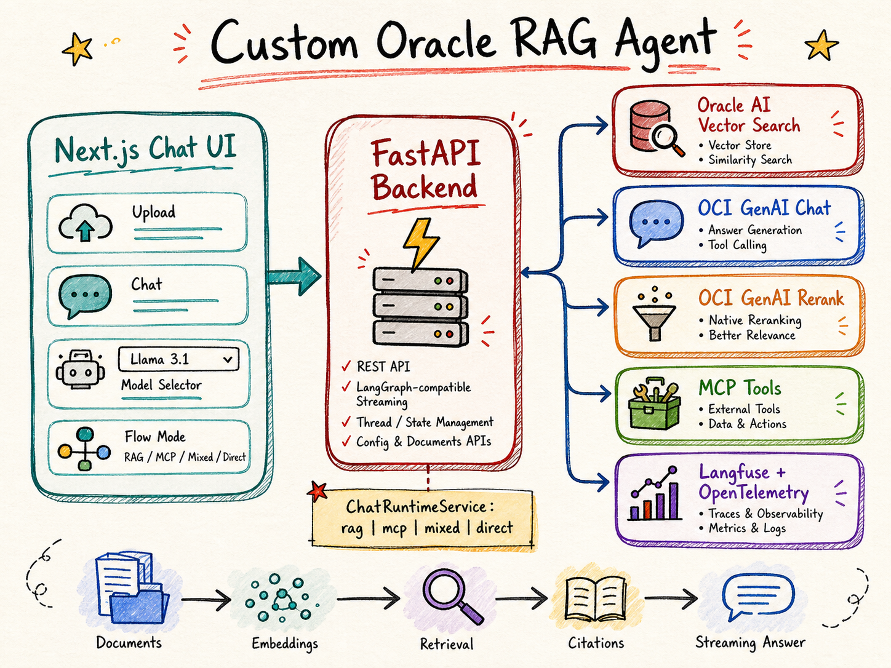

# Building an Oracle RAG Agent with FastAPI, Oracle AI Vector Search, OCI Generative AI, and MCP

Enterprise RAG stops being a chatbot the moment users need citations, source management, tool calls, runtime controls, and traces that explain why an answer came out the way it did.

This app is built for that harder version: a chat workspace where Oracle AI Vector Search grounds answers, OCI Generative AI handles chat and reranking, MCP tools can extend the agent, and the UI makes those choices visible instead of hiding them behind one magic prompt box.

## The app is a workspace, not a prompt demo

The first design decision was to treat RAG as an application workflow.

A prompt demo only needs a text box and a model response. This app needs more surface area because the user is managing a knowledge base and testing different execution paths. The UI supports document upload, processed source review, model selection, flow mode selection, citations, and feedback.

That changes the backend too. The API cannot be a thin wrapper around a single LLM call. It has to normalize chat turns, select runtime mode, retrieve from Oracle AI Vector Search, rerank candidate chunks, call MCP tools when enabled, stream the answer, preserve thread state, and return metadata the UI can display.

The result is a reference implementation for an Oracle-backed RAG agent workspace rather than a one-path tutorial.

## The architecture has one important boundary: the runtime coordinator

The key backend idea is a runtime coordinator that sits behind the FastAPI routes.

FastAPI receives the request. The frontend provides user choices such as model, collection, flow mode, and MCP server keys. The backend turns those choices into a runtime config and sends the turn through one coordinator instead of scattering decision logic across routes, UI components, and prompt templates.

That service owns the core dispatch:

- `rag` for Oracle retrieval and grounded answer synthesis
- `mcp` for tool-only agent execution
- `mixed` for Oracle retrieval plus MCP tools
- `direct` for plain model chat

This keeps the app explainable. If a user chooses `rag`, the backend should retrieve documents and synthesize from them. If they choose `direct`, retrieval should not quietly happen in the background. If they choose `mixed`, the model gets a broader toolbox, but the app still preserves grounding behavior when Oracle retrieval returns documents.

That explicit boundary is what keeps the system from turning into a pile of special cases. One backend layer decides which execution path is allowed for the turn, and every mode returns metadata the UI can explain.

## Oracle AI Vector Search is the knowledge layer

The app uses OracleVS-compatible tables through `langchain-oracledb`. The table shape is intentionally conventional: text, JSON metadata, and a VECTOR column for embeddings.

The important part is not just storing vectors. It is preserving document identity.

The app expects metadata such as `source_url`, `file_name`, and `source` because citations and source-management UI depend on those fields. Retrieval is only useful to users if the answer can point back to the source that grounded it.

That is why the app treats citation normalization as shared core behavior rather than a presentation flourish. Retrieval results flow through backend response shaping and then into the frontend as visible references.

The processed sources view matters because it gives the user confidence that the app is searching the collection they think it is searching. For enterprise RAG, this is not cosmetic. Wrong or stale source state is one of the fastest ways to make a correct architecture produce bad answers.

## OCI Generative AI handles more than final answer generation

OCI Generative AI appears in several parts of the workflow:

- chat completion for answer synthesis
- embeddings for document and query representation
- native reranking for retrieved candidate chunks
- tool-calling behavior in MCP and mixed paths
- follow-up interpretation and answer transformation behavior

Reranking is especially useful because the first vector-search result is not always the best context to put in front of the model. The app can retrieve candidate chunks, rerank them, and then pass the stronger context set into answer synthesis.

That creates a better debugging story too. If an answer looks weak, you can inspect whether retrieval failed, reranking changed the order in a surprising way, or synthesis ignored useful context.

Without that separation, every bad answer looks like “the model was wrong.” In a real RAG app, that explanation is usually too vague to help.

## Runtime modes make the app testable

The mode selector is one of the most useful pieces of the UI because it lets you compare behavior without changing code.

The modes are intentionally explicit:

| Mode | What the app is testing |
| --- | --- |
| `rag` | Can Oracle retrieval and answer synthesis produce a cited answer? |
| `direct` | What does the model say without the knowledge base? |
| `mcp` | Can configured tools answer or act without local retrieval? |
| `mixed` | Can the agent combine Oracle retrieval with external tools? |

This matters during evaluation. A direct answer may sound fluent but lack grounding. A RAG answer may cite the right source but miss an external action. An MCP answer may call the right tool but lose document context. Mixed mode exists for the cases where the user needs both.

## Mixed mode is the most app-specific part

Mixed mode gives the agent two kinds of capabilities in one turn: configured MCP tools and a local `oracle_retrieval` tool.

When the agent uses `oracle_retrieval` and gets documents back, the final response is synthesized through the RAG answer path. That keeps retrieved documents, citations, and context usage visible to the UI. Non-retrieval MCP outputs from the same turn can still be included as supplemental context.

That handoff is subtle, but important.

Many agent demos let the agent call a retriever and then produce a final answer inside the same opaque loop. The user sees an answer, but the application has a harder time showing what grounded it. This app keeps the RAG synthesis step explicit when retrieval succeeds.

The payoff is better traceability. You can tell whether the agent used Oracle retrieval, whether MCP tools contributed extra information, and whether the final answer was grounded in retrieved documents.

## MCP configuration belongs in the product UI

MCP servers are runtime dependencies. They can be enabled, disabled, authenticated, tested, and swapped. Treating them as only `.env` configuration makes local experimentation painful and makes the product harder to operate.

In this app, the Settings page is the primary MCP configuration surface. `.env` can still seed server config for headless or first-run setups, but interactive configuration lives in the UI and is persisted server-side.

That split matches how users actually work. A developer may start with one semantic-search MCP, add an external calculator or workflow tool, test a remote authenticated MCP server, and disable a broken endpoint without editing environment variables every time.

The app also avoids returning secret values to the browser. The frontend can show whether auth is configured, but the secret itself stays server-side.

## The UI exposes the backend decisions

The main chat workspace is designed around the idea that users should see the major runtime controls.

Document upload sits near chat because knowledge-base changes affect answer quality immediately. The user should not have to leave the workspace to add context and then test whether retrieval sees it.

The model selector is also visible because model choice is part of the experiment. Different OCI model configurations can change style, latency, tool-calling behavior, and answer quality.

The UI is not trying to hide complexity. It is trying to put the right complexity in front of the user: model, mode, collection, sources, citations, and tool availability.

That is the right bias for a reference app. When you are building or evaluating RAG, hiding runtime choices makes the app feel simpler but makes failures harder to explain.

## FastAPI keeps the public contracts stable

FastAPI provides the backend surface for config, documents, feedback, health, suggestions, and chat streaming.

That is why the app does not replace the backend with a LangGraph or LangChain server surface.

LangGraph Server is a good fit when the primary product is a graph execution API: threads, runs, assistants, state, streaming, and persistence around graph execution. This app needs that shape for chat streaming, but it also needs product-specific endpoints that are not just graph execution: upload and manage documents, expose available models and collections, store feedback, test MCP server configuration, provide suggestions, and return a lightweight health response that does not depend on Oracle or OCI being reachable.

LangGraph deployments can support custom HTTP routes, including FastAPI routes. That points to the same conclusion rather than the opposite one: the agent runtime is only one part of the backend contract. The app still needs an API layer that owns product behavior around the runtime.

The important part is contract stability. Runtime response fields such as `final_answer`, `citations`, `reranker_docs`, `context_usage`, and MCP metadata are not internal trivia. They are how the UI explains what happened during a turn.

The streaming endpoint follows a LangGraph-compatible thread/run shape so the frontend can consume a stable event stream while the backend keeps the runtime implementation behind the service boundary.

That means streaming changes need discipline. If the backend changes the event shape, the UI and stream tests need to move together. A streaming RAG app is not just “return text slowly.” It is a state contract between the runtime and the interface.

## Observability is where agent behavior becomes debuggable

A normal API log can tell you a chat request returned `200`. It will not tell you whether the answer used retrieval, which chunks were reranked, whether a tool was called, or why a final answer ignored a source.

That is why the app includes optional OpenTelemetry, Grafana/Tempo/Loki, OCI APM-compatible routing, and Langfuse.

Langfuse is especially useful for mixed and MCP paths because one chat turn can include multiple model calls, tool calls, retrieved documents, reranked candidates, and feedback scores. When the answer is wrong, the trace can separate the possible causes:

- the wrong documents were retrieved
- relevant documents were retrieved but reranked poorly
- the model ignored useful context
- the agent called the wrong tool
- the frontend displayed a stream state incorrectly
- a proxy or runtime layer failed even though the backend completed work

That last point is not theoretical. In a multi-layer app, browser-visible failures can come from the frontend proxy, backend API, model provider, MCP server, or observability stack. The trace and logs keep you from guessing.

## What this app gets right, and where it is still work

The strongest part of the architecture is that the major paths are explicit. RAG, direct chat, MCP tools, and mixed execution are separate enough to test and compare, but close enough to use in one workspace.

The second strong choice is UI-managed MCP configuration. Tool servers are part of the product surface, so users need a product surface to manage them.

The third is observability. Agentic applications need traces because the interesting failures happen inside the request, not just at the HTTP boundary.

The trade-off is setup complexity. Oracle Database vector search, OCI Generative AI, wallet-based connectivity, MCP server configuration, and tracing are real infrastructure. The app is a reference implementation, not a zero-config starter.

That is a useful trade-off for the intended audience. If you are building on Oracle and OCI, the hard part is not proving that a vector search call works. The hard part is building a workspace where retrieval, tools, citations, models, streaming, and traces all stay understandable as the app grows.

This app is a concrete version of that workspace.

For setup and implementation details, use the project docs:

- [Getting started](../GETTING-STARTED.md)
- [Configuration](../CONFIGURATION.md)
- [Database setup](../DATABASE-SETUP.md)
- [Document population](../DOCUMENT-POPULATION.md)
- [MCP usage](../MCP-USAGE.md)
- [Observability](../OBSERVABILITY.md)
