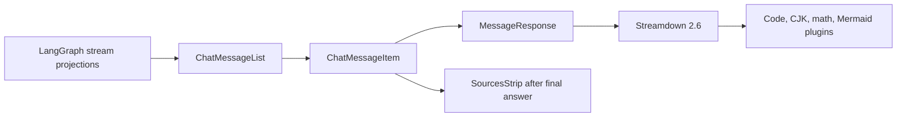
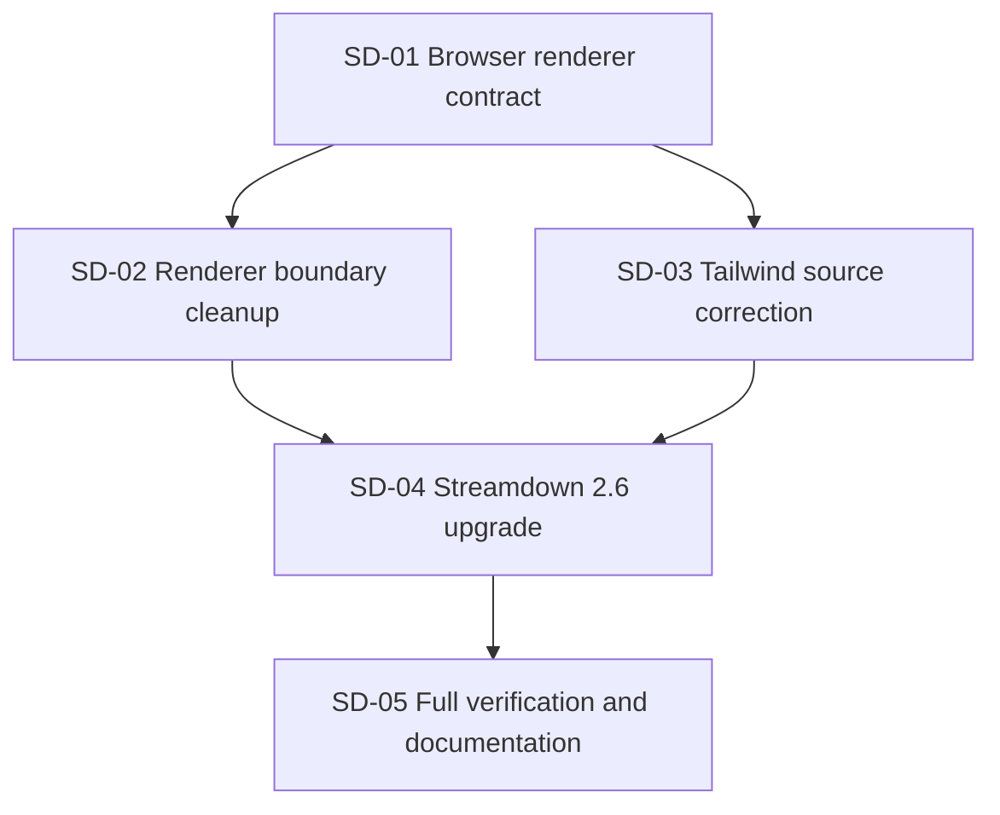

# Streamdown 2.6 renderer integration specification

> **Status:** Blocked by the streamed-math compatibility gate.
> **Decision:** Keep the current renderer boundary, tighten its contract, correct its styling inputs, then upgrade Streamdown to 2.6.0 behind browser-level compatibility tests.

## Implementation result

The 2026-09-21 implementation attempt was rolled back after the deterministic Chromium gate reproduced the Streamdown 2.6.0 streamed-math defect described in the upstream report. With React 19.2.8, `@streamdown/math` 1.0.2, and Streamdown 2.6.0, the completed incremental matrix produced duplicated visual math without a valid `.katex-display` block. Five of eight renderer scenarios passed, including the 360-frame stream, same-length replacement, code, table, and Mermaid checks. Streamed math, streamed link semantics, and live-to-static code equivalence remained red.

No renderer fallback, content detector, package override, or partial 2.6 integration was retained. The frontend remains on Streamdown 2.5.0 until an upstream-compatible release can pass this contract.

## Problem

The frontend currently uses Streamdown 2.5.0 for both live assistant output and persisted-message replay. The integration already has the right broad ownership split: LangGraph and `@langchain/react` own chat state, `ChatMessageItem` decides which product UI to show, and `MessageResponse` renders Markdown.

The integration has four weaknesses that make a direct version-only update unsafe:

1. `MessageResponse` exposes the complete Streamdown prop API instead of owning one application rendering policy.
2. Its custom `memo` comparison only observes `children` and `isAnimating`, so changes to mode, components, plugins, controls, translations, link safety, or themes can be discarded.
3. `ChatMessageItem` repeats the streaming and static renderer configuration across three branches.
4. `globals.css` points Tailwind at `src/node_modules`, which does not exist, and omits the installed Streamdown plugin packages from source discovery.

Streamdown 2.6.0 also changes the exact code path this application uses. It rewrites streaming animation scheduling, fixes stale same-length replacements, changes link-safety modal rendering, and updates code, table, and Mermaid controls. An open upstream report describes corrupted block math under rapid token streaming with Streamdown 2.6.0, `@streamdown/math` 1.0.2, and React 19.2.x. That combination is close enough to this application that streamed math is a release gate.

## Goals

- Upgrade the frontend from Streamdown 2.5.0 to 2.6.0.
- Keep one authoritative Markdown renderer for live streaming and replay.
- Make invalid renderer states unrepresentable through the application component API.
- Remove redundant memoization that can preserve stale renderer configuration.
- Correct Tailwind source discovery for Streamdown core and the four installed plugins.
- Load the KaTeX stylesheet through a declared frontend dependency so rendered equations have their required layout.
- Prove long animated streaming, same-length replacements, block math, links, code, tables, Mermaid, and static replay in a real browser.
- Preserve message content, citations, tool cards, chat transport, thread replay, and current security behavior.

## Non-goals

- Replacing Streamdown with another Markdown renderer.
- Changing LangGraph events, `@langchain/react`, message projection, citations, tools, or persistence.
- Adding a fallback renderer or keeping parallel 2.5 and 2.6 code paths.
- Disabling animation or math to avoid a compatibility failure.
- Adopting `codeBlockMaxHeight`, `tableMaxHeight`, custom download filenames, image controls, or CSV separator settings in this delivery.
- Redesigning message visuals or changing the existing list spacing.
- Removing the explicit Mermaid plugin. The application supports Mermaid output, so Mermaid remains an intentional dependency.

## Target design

`MessageResponse` remains the application boundary around Streamdown. It owns the plugins, Markdown element components, rendering mode, animation policy, and base classes.

Its public contract becomes:

```ts
type MessageResponseProps = {
  children: string;
  className?: string;
  streaming: boolean;
};
```

The component derives the Streamdown settings internally:

```tsx
<Streamdown
  className={...}
  components={markdownComponents}
  isAnimating={streaming}
  mode={streaming ? "streaming" : "static"}
  plugins={streamdownPlugins}
>
  {children}
</Streamdown>
```

Do not wrap this component in another custom `memo`. Streamdown 2.6.0 already memoizes its renderer and individual blocks. React Compiler remains free to optimize the application component without an incomplete hand-written prop comparison.

`ChatMessageItem` renders the answer once. `SourcesStrip` stays a sibling after the final answer when citations exist. Streaming state remains derived by `ChatMessageList`; the renderer does not inspect transport events or own chat state.



## Styling contract

`frontend/src/app/globals.css` is two directories below `frontend/node_modules`. Tailwind source directives must therefore use `../../node_modules`, not `../node_modules`.

The stylesheet must include the packages the renderer imports:

```css
@import "katex/dist/katex.min.css";

@source "../../node_modules/streamdown/dist/*.js";
@source "../../node_modules/@streamdown/cjk/dist/*.js";
@source "../../node_modules/@streamdown/code/dist/*.js";
@source "../../node_modules/@streamdown/math/dist/*.js";
@source "../../node_modules/@streamdown/mermaid/dist/*.js";
```

Do not add sources for packages that are not installed. Declare `katex` directly in the frontend because pnpm does not expose the math plugin's transitive package for an application-level CSS import. Keep the direct version compatible with the range declared by `@streamdown/math`.

## Browser compatibility contract

The upgrade is accepted only when a real Chromium page proves all of the following:

- A long animated response completes without `Maximum update depth exceeded`, a frozen first block, or a page error.
- A same-length text replacement updates the visible Markdown instead of preserving stale output.
- Incrementally streamed block math ends with valid KaTeX markup and does not show duplicated raw LaTeX.
- The same completed math content renders equivalently after switching to static mode.
- A streamed external link completes correctly, opens the link-safety dialog, and causes no invalid DOM nesting or hydration error.
- Fenced code retains line structure and exposes accessible controls.
- A table retains its rows and accessible controls after streaming completes.
- A Mermaid block completes without a page error and exposes its supported controls.
- Final replay uses the same renderer configuration as the completed live response.

The streamed-math check is a hard gate. If Streamdown 2.6.0 reproduces the upstream corruption report, stop the upgrade. Do not ship a content detector, alternate renderer, disabled animation, disabled math, or other fallback. Resolve the defect at the Streamdown boundary or wait for a fixed upstream release.

## Ticket dependency graph



## Tickets

### SD-01: Add a deterministic browser renderer contract

**Owner:** Frontend tests

**Dependencies:** None

**Files:**

- `frontend/src/app/e2e/streamdown/page.tsx`, new deterministic browser harness
- `frontend/tests/e2e/streamdown-rendering.spec.ts`, new Playwright coverage
- Shared test helpers only if two or more tests need the same behavior

**Work:**

- Build a client-only harness that renders `MessageResponse` from controlled content prefixes.
- Let tests start a scenario, advance or run all frames, finish streaming, and switch the same content to static replay.
- Include fixtures for long prose, same-length replacement, a matrix block, an external link, fenced code, a table, and Mermaid.
- Capture `pageerror` and relevant console errors for every scenario.
- Assert visible and semantic output. Do not assert Streamdown implementation details that users cannot observe, except stable DOM markers needed to prove KaTeX and dialog semantics.
- Keep the harness deterministic and independent of a backend, model, network request, or timer race.

**Acceptance criteria:**

- The suite can drive hundreds of incremental frames without using LangGraph or a live provider.
- The long-stream test detects update-depth errors and frozen output.
- The math test distinguishes valid KaTeX from raw or duplicated LaTeX.
- The static replay test uses the final live content and compares user-visible output.
- Tests fail with a clear assertion if the known Streamdown 2.6 math risk appears.

### SD-02: Make `MessageResponse` own Markdown rendering policy

**Owner:** Frontend presentation

**Dependencies:** SD-01

**Files:**

- `frontend/src/components/ai-elements/message.tsx`
- `frontend/src/components/chat/ChatMessageItem.tsx`

**Work:**

- Replace `ComponentProps<typeof Streamdown>` with the narrow application contract defined in this specification.
- Move the stable `markdownComponents` list renderers beside `streamdownPlugins` in `message.tsx`.
- Remove the outer custom `memo` and its two-field comparison.
- Derive `mode` and `isAnimating` from the single `streaming` prop.
- Collapse the three `MessageResponse` branches in `ChatMessageItem` into one answer render.
- Keep citations after the renderer and only after streaming completes.
- Remove imports and types made obsolete by the ownership move.

**Acceptance criteria:**

- Callers cannot pass conflicting `mode` and `isAnimating` values.
- Callers cannot replace plugins, controls, link safety, translations, or Markdown components ad hoc.
- The answer is rendered once per message branch.
- Citation visibility, copy actions, feedback, retry controls, and tool cards retain their existing conditions.
- No legacy prop shape or compatibility wrapper remains.

### SD-03: Correct Streamdown Tailwind source discovery

**Owner:** Frontend styling

**Dependencies:** SD-01

**Files:**

- `frontend/src/app/globals.css`
- `frontend/package.json`
- `frontend/pnpm-lock.yaml`

**Work:**

- Correct the core Streamdown source path to `../../node_modules`.
- Add source directives for CJK, code, math, and Mermaid packages.
- Declare the resolved compatible KaTeX line as a direct frontend dependency.
- Import `katex/dist/katex.min.css` once from the global stylesheet.
- Do not import a second Streamdown stylesheet or load KaTeX CSS from a second location.
- Use the browser fixtures to confirm code, table, Mermaid, and modal controls receive their expected layout and are not unstyled raw elements.

**Acceptance criteria:**

- Every source directive resolves to an installed package directory.
- The KaTeX stylesheet resolves through a declared direct dependency, and browser math fixtures have KaTeX positioning styles.
- The production build scans Streamdown core and each installed plugin without warnings.
- The renderer fixtures retain usable overflow, control layout, and dark/light token styling.

### SD-04: Upgrade Streamdown to 2.6.0

**Owner:** Frontend dependencies

**Dependencies:** SD-02 and SD-03

**Files:**

- `frontend/package.json`
- `frontend/pnpm-lock.yaml`

**Work:**

- Change the direct Streamdown range from `^2.5.0` to `^2.6.0`.
- Regenerate the lockfile with the repository pnpm workflow.
- Preserve the direct KaTeX dependency and its single global stylesheet import established by SD-03.
- Keep the existing plugin versions unless the package manager identifies a declared incompatibility.
- Confirm React 19.2.8 satisfies the resolved peer ranges.
- Confirm the removal of Mermaid from Streamdown core does not remove the Mermaid package required by `@streamdown/mermaid`.
- Run the deterministic browser contract before making any optional use of new 2.6 props.

**Acceptance criteria:**

- The lockfile resolves exactly one Streamdown 2.6.x installation for the frontend.
- No peer-dependency warning is introduced for React, React DOM, or Streamdown plugins.
- Long animated streaming and same-length replacements pass.
- The streamed-math hard gate passes.
- Link safety, code, table, Mermaid, and static replay checks pass.
- No fallback, version alias, package override, or vendored Streamdown patch is introduced.

### SD-05: Run the full frontend gate and record the result

**Owner:** Frontend release verification

**Dependencies:** SD-04

**Files:**

- `CHANGELOG.md`
- `frontend/README.md` only if its renderer or bundle claims need correction
- Test evidence in the final implementation report

**Work:**

- Run `pnpm test`, `pnpm lint`, `pnpm build`, and the focused Streamdown Playwright suite.
- Run the existing mocked chat-streaming suite to prove the renderer remains connected to the application stream path.
- Run `pnpm check` and `pnpm knip`; separate pre-existing diagnostics from new failures.
- Run the live chat path when the Agent Server is available. If it is unavailable, report exactly which live behavior remains unproven.
- Compare the dependency audit with the pre-upgrade result and explain whether removing Streamdown's hard Mermaid dependency changes this application's installed advisory graph.
- Add a changelog entry describing the renderer contract cleanup, corrected Tailwind discovery, Streamdown update, and browser regression coverage.

**Acceptance criteria:**

- Unit tests, ESLint, production build, focused renderer tests, and mocked chat streaming pass.
- Ultracite and Knip introduce no new diagnostics compared with the recorded baseline.
- The changelog describes user-visible fixes and compatibility coverage without claiming unrun live validation.
- `git diff --check` passes.
- The final report names every check, its result, and any external blocker.

## Completion criteria

The work is complete when all five tickets are satisfied, Streamdown 2.6.0 is the only resolved core version, the streamed-math gate passes, and the application has one renderer path for both live and replayed assistant Markdown. A successful build without the browser renderer contract is not sufficient.

## References

- [Streamdown 2.6.0 release notes](https://github.com/vercel/streamdown/releases/tag/streamdown%402.6.0)
- [Streamdown 2.6.0 package metadata](https://github.com/vercel/streamdown/blob/streamdown%402.6.0/packages/streamdown/package.json)
- [Open Streamdown 2.6.0 streamed block-math report](https://github.com/vercel/streamdown/issues/601)

## Rollback

Rollback means reverting this focused change set, including the dependency manifest, lockfile, renderer refactor, CSS sources, tests, and documentation. Do not retain dormant 2.6 configuration, a second renderer, or conditional version behavior after rollback.
