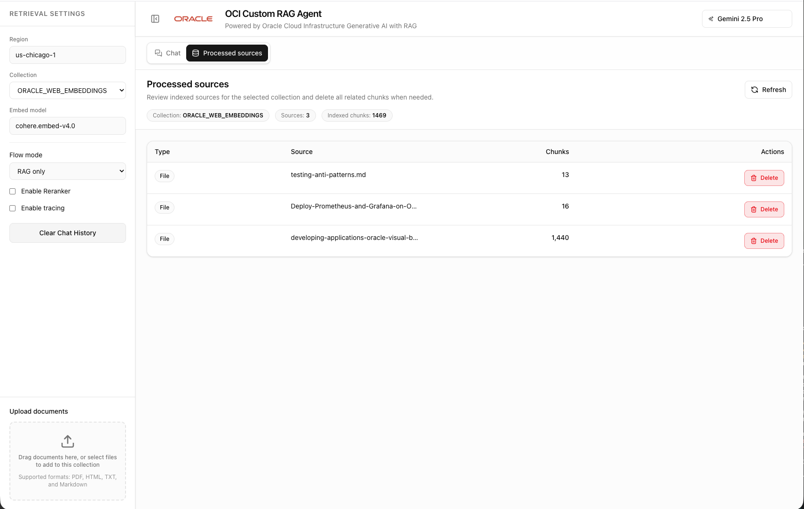

# OCI Custom RAG Agent — Frontend

Next.js frontend for the **OCI Custom RAG Agent**: a chat app powered by **Oracle Cloud Infrastructure (OCI) Generative AI** with **retrieval-augmented generation (RAG)** and optional **MCP (Model Context Protocol)** tools. Users ask questions, get answers grounded in your documents, and can choose flow modes (RAG only, MCP tools only, mixed, or direct).



## What this app does

- **Chat** with OCI-hosted models (e.g. Llama, Grok) via the AI SDK; streaming responses with citations.
- **RAG**: query a configurable document collection with an optional reranker.
- **Flow modes**: RAG only, MCP tools only, mixed (RAG + tools), or direct (no RAG, no tools).
- **Model selector**: switch models from the header.
- **Sidebar**: region/embed model (read-only from backend), collection, flow mode, reranker/tracing toggles, clear chat, and **document upload** (PDF, HTML, TXT, MD) into the current collection.
- **Citations**: inline source markers and a sources strip under assistant messages; optional feedback (when enabled by backend config).

## Important details

- **Backend required**: This UI talks to the repo’s FastAPI backend (LangChain runtime + MCP). Start the API first (e.g. `./run_api.sh` from the repo root; default port `3002`). See the root [AGENTS.md](../AGENTS.md) for full topology.
- **Package manager**: Use **pnpm** for install, dev, and build (see repo Cursor rule).
- **Environment**: Copy `env.example` to `.env.local` and set `NEXT_PUBLIC_API_BASE` for direct browser-to-backend calls (default `http://localhost:3002`).
- **Config**: App config (region, model list, collections, feature flags) is loaded on the server in the root layout and provided via `ConfigProvider`; the chat page does not fetch config on the client.

## Getting started

From the **frontend** directory:

```bash
pnpm install
cp env.example .env.local   # edit NEXT_PUBLIC_API_BASE if needed
PORT=4000 pnpm dev
```

Open [http://localhost:4000](http://localhost:4000). Next.js defaults to port 3000, but this repo standardizes on 4000 to match the Docker mapping.

## Scripts

| Command       | Description                |
| ------------- | -------------------------- |
| `pnpm dev`    | Start Next.js dev server    |
| `pnpm build`  | Production build            |
| `pnpm start`  | Run production server       |
| `pnpm lint`   | Run ESLint                  |

## Performance

This app follows the **Vercel React Best Practices** guidelines (`.cursor/skills/react-best-practices/` in the repo). Applied rules include:

- **Server config** – Config is fetched in the root layout (RSC) and passed via `ConfigProvider` to avoid a client-side config waterfall.
- **Bundle** – No barrel imports; heavy UI (message/streamdown/katex, code-block/shiki) is loaded with `next/dynamic` and `ssr: false` on demand.
- **Re-renders** – `bodyParams` for chat is memoized with `useMemo`; `SourcesStrip` is memoized; scroll uses a passive listener; static JSX (e.g. streaming indicator) is hoisted.

When adding or changing code: prefer primitive or memoized dependencies in `useCallback`/`useEffect`; do not add barrel re-exports from `@/components`; use ternaries for numeric conditional rendering to avoid rendering `0` or `NaN`.

## Tech stack

- **Next.js 16** (App Router), **React 19**, **TypeScript**
- **Tailwind CSS**, **shadcn-style** UI primitives
- **AI SDK** (`@ai-sdk/react`, `ai`) for chat and streaming
- **streamdown** / **katex** for message rendering; **shiki** for code blocks
